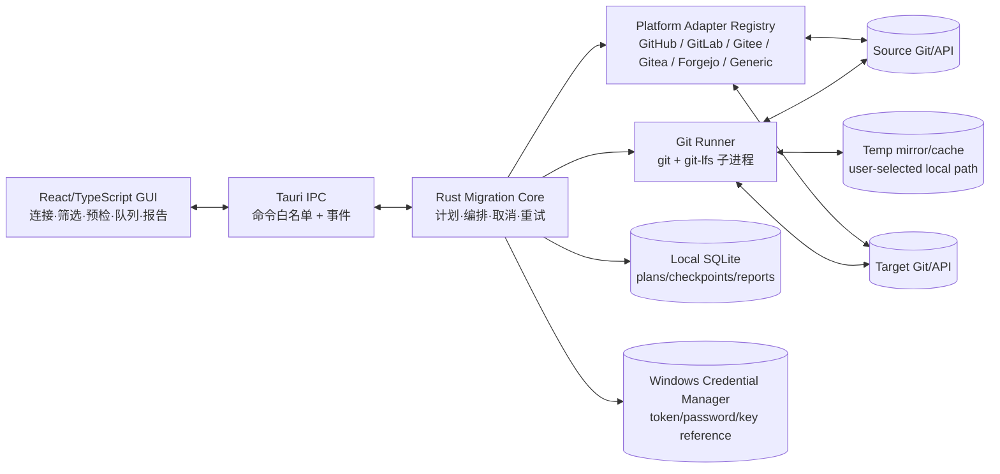
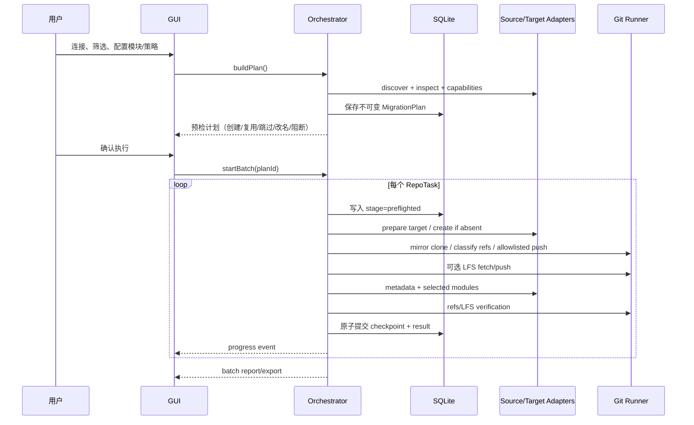

## 摘要

Git Repo Migrator 采用 Windows 优先的单机桌面架构：Tauri 2 负责窗口、安装和受控 IPC，React/TypeScript 负责可视化界面，Rust 迁移引擎负责平台连接、Git/LFS 执行、队列调度、校验和报告。应用不提供业务服务端，不上传或持久化用户代码；平台 API 和 Git SSH/HTTPS 连接均由本机直接发起。

核心设计原则：

1. **Git 与平台数据分层**：通用 Git 服务至少支持镜像迁移和校验；Issues、PR/MR、Wiki、Release、附件和元数据通过能力可探测的适配器按模块执行。
2. **计划先于写入**：所有批量任务先生成不可变的预检计划，明确创建、复用、跳过、改名、降级和阻断项；默认不覆盖非空目标。
3. **阶段检查点**：每个仓库按预检、目标准备、Git、LFS、元数据、平台模块、校验保存检查点，重启后只从未完成阶段继续。
4. **秘密不进任务库**：令牌、密码和私钥只通过 Windows Credential Manager/DPAPI 保护，SQLite 只保存凭据引用和非秘密任务元数据；日志和导出报告统一脱敏。
5. **适配器隔离差异**：平台差异集中在 `PlatformAdapter`，迁移编排器只依赖统一的内部模型和能力矩阵。

## 1. 技术调研与选型依据

### 1.1 真实参考资料

以下资料是架构决策依据，链接均指向官方文档或公开开源项目（调研日期：2026-08-26）：

| 领域 | 参考 | 对本项目的结论 |
|---|---|---|
| Git 镜像 | [Git `clone --mirror`](https://git-scm.com/docs/git-clone)、[Git refspec](https://git-scm.com/book/en/v2/Git-Internals-The-Refspec) | 使用 mirror clone 获取对象，再按白名单 refspec 推送；执行前后必须记录 refs 快照，禁止盲目把平台私有 refs 推到目标。 |
| Git LFS | [Git LFS 官方](https://git-lfs.com/)、[Git LFS migrate](https://github.com/git-lfs/git-lfs) | 复用系统 `git-lfs`，以 `fetch --all`/`push --all` 和对象可读性校验完成迁移。 |
| GitHub | [REST API](https://docs.github.com/en/rest)、[fine-grained tokens](https://docs.github.com/en/authentication/keeping-your-account-and-data-secure/managing-your-personal-access-tokens) | 使用仓库读取、创建和元数据所需最小权限；按分页和 rate-limit 响应退避。 |
| GitLab | [REST API](https://docs.gitlab.com/api/)、[Project import/export](https://docs.gitlab.com/user/project/settings/import_export/) | Self-Managed 以用户配置的实例 URL 为根；API 能力与 Git 数据迁移解耦。 |
| Gitea/Forgejo | [Gitea API](https://docs.gitea.com/api/1.24/)、[Forgejo API](https://forgejo.org/api/) | 共享大部分仓库/Issue/Release 抽象，但必须在连接时探测版本和可用端点。 |
| 桌面运行时 | [Tauri 2](https://v2.tauri.app/)、[Electron](https://www.electronjs.org/docs/latest/) | Tauri 的原生 WebView 和 Rust 命令适合 Windows 本地工具；Electron 作为备选。 |
| 本地凭据 | [Windows Credential Manager](https://learn.microsoft.com/windows/win32/secauthn/credentials-management)、[DPAPI](https://learn.microsoft.com/windows/win32/api/dpapi/) | 凭据不写配置文件；使用用户/机器上下文保护，删除连接时撤销引用。 |
| 本地状态 | [SQLite](https://www.sqlite.org/docs.html) | 单文件事务数据库足以支撑检查点、队列和报告，不需要 PostgreSQL/Redis。 |
| 批量备份实践 | [ghorg](https://github.com/gabrie30/ghorg) | 过滤、批量发现和本地执行方式可借鉴，但本项目增加目标写入、冲突和校验。 |

### 1.2 桌面技术比较

| 方案 | 优点 | 代价/风险 | 决策 |
|---|---|---|---|
| Tauri 2 + React + Rust | Windows 原生窗口、包体小；Rust 适合子进程、并发和取消；IPC 边界明确 | 需维护 Rust/TS 两套类型；WebView2 为系统依赖 | **采用**。与本地执行和隐私目标最匹配。 |
| Electron + React + Node.js | 生态成熟，Git/HTTP npm 包丰富，团队易上手 | 包体和内存较大；Node 子进程/文件权限边界需额外加固 | 备选；若 Rust 人才不足可评估迁移。 |
| WinUI 3/WPF + .NET | Windows 集成、凭据和安装体验好 | UI 跨平台复用弱；未来 CLI/其他桌面端需重写核心 | 不采用作为主架构；可用于纯 Windows 重写。 |

### 1.3 核心库比较

| 能力 | 方案 | 结论 |
|---|---|---|
| Git 执行 | 调用用户安装的 `git.exe`/`git-lfs.exe` | **采用**。兼容用户 SSH、代理、凭据助手和 LFS 配置；不自行实现 Git 协议。 |
| Git 执行 | libgit2/git2-rs | 适合嵌入式读写，但 SSH、LFS、credential helper 行为与系统 Git 不完全一致 | 仅作为未来无 Git 环境的可选后端。 |
| HTTP API | Rust `reqwest` + JSON DTO | **采用**。超时、代理、TLS 和重试可统一控制；平台适配器不共享业务状态。 |
| 本地状态 | SQLite（`rusqlite`） | **采用**。事务和 WAL 保证检查点原子性；数据量远小于单机数据库能力上限。 |
| 密钥 | Windows Credential Manager（`keyring`/原生 API） | **采用**。数据库只保存 `credential_ref`。 |

## 2. 架构概述

### 2.1 架构类型选择

**本项目选择：单机模块化单体（Desktop Modular Monolith）**。没有前后端分离、微服务、云端队列或 JWT 登录。UI、编排器、适配器和本地存储在同一应用进程/受控 Rust sidecar 中，通过 Tauri command 和事件通信。

选择理由：

- 迁移数据必须在源和目标之间直接流动，单机执行天然符合隐私要求。
- 100+ 仓库需要持久检查点，而不是远端任务状态；SQLite 事务可恢复且零配置。
- 平台差异可以用 trait/插件目录隔离，暂不需要微服务网络边界。
- Tauri 的 UI 进程不直接访问凭据、文件系统或 shell；所有高权限动作由 Rust 命令白名单执行。

### 2.2 系统边界图



### 2.3 数据路径与隐私边界

- 仓库对象、LFS 文件、Issue 内容和附件只经过本机内存/临时目录以及用户指定的源、目标地址。
- 应用更新检查若启用，只访问固定更新地址；不得把任务日志、崩溃报告或仓库 URL 自动发送到产品服务端。
- 临时镜像目录由任务级 `workspace_path` 指定。完成/取消后依清理策略删除；用户选择保留时在报告显示路径。
- SQLite 中允许保存 URL、名称、状态、错误和 refs 摘要；令牌、密码、私钥、Cookie 和完整响应体禁止写入。

## 3. 分层与模块

### 3.1 表现层（Tauri + React）

- `ConnectionView`：平台地址、类型、认证方式、权限摘要和自签名证书指纹确认。
- `DiscoveryView`：分页仓库列表、权限标签、筛选器、全选后排除和手动 URL 导入。
- `MappingView`：目标组织、命名规则、可见性、模块开关和映射冲突。
- `PreflightView`：只读计划预览，阻断项必须先修正或排除。
- `QueueView`：批次进度、仓库阶段、暂停/恢复/重试/取消和限流状态。
- `ReportView`：逐仓库结果、校验摘要、未映射字段和 JSON/CSV 导出。

UI 仅调用白名单命令，不拼接 shell 命令，不读取令牌，不持有 API 客户端对象。进度通过事件订阅，事件载荷不得包含令牌或完整响应体。

### 3.2 应用层（Use Cases）

- `ConnectionService`：解析地址、识别平台、测试凭据、获取能力矩阵。
- `DiscoveryService`：分页拉取仓库、合并权限、统一为 `RepositoryCandidate`。
- `PlanService`：执行命名/筛选/排除规则，生成不可变 `MigrationPlan`。
- `PreflightService`：校验源读、目标写/建库、目标状态、磁盘、模块能力和冲突策略。
- `MigrationOrchestrator`：按仓库和阶段调度 `StageRunner`，写检查点，处理取消和重试。
- `VerificationService`：比较 refs、对象可达性、LFS 和元数据/平台模块计数。
- `ReportService`：从事件和结果生成脱敏报告。

### 3.3 领域层

领域层定义平台无关模型、状态机和策略，不依赖 Tauri、HTTP 或 SQLite：

- `MigrationPlan`、`RepositoryMapping`、`ConflictPolicy`、`ModuleSelection`。
- `RepoTaskState`：`planned → preflighted → preparing → git → lfs → metadata → platform_modules → verifying → succeeded/partial/skipped/retryable_failed`。
- `Checkpoint`：阶段、输入快照哈希、输出摘要、时间和可重入标记。
- `CapabilityMatrix`：发现、创建、元数据、Issue、PR/MR、Wiki、Release、LFS 等能力及原因。
- `PlatformModuleResult`：每个专属模块必须声明 `fidelity`（`native_rebuild`、`read_only_archive` 或 `unsupported`），并记录身份、状态、附件、源链接映射及逐项失败。
- 错误分类：`Auth`, `Permission`, `Conflict`, `RateLimited`, `Network`, `Validation`, `Disk`, `Unsupported`, `Git`, `Verification`。

### 3.4 基础设施层

- `GitRunner`：仅调用白名单中的 Git 可执行文件；参数数组传递，禁止 shell 拼接；捕获退出码和脱敏 stderr。
- `HttpTransport`：统一 TLS、代理、超时、分页、限流退避和 `Retry-After` 处理。
- `CredentialStore`：Windows Credential Manager/DPAPI，返回短生命周期 secret，不在日志中序列化。
- `LocalStore`：SQLite 事务、WAL、迁移版本、崩溃恢复和导出。
- `WorkspaceManager`：镜像目录配额、磁盘预检、锁文件、清理和恢复扫描。
- `EventBus`：将领域进度事件转成 Tauri 事件；事件只含 ID、阶段、进度和错误摘要。

## 4. 平台适配器设计

### 4.1 统一接口

```rust
trait PlatformAdapter: Send + Sync {
    fn identify(&self, endpoint: &Endpoint) -> Result<PlatformIdentity>;
    async fn test_connection(&self, auth: &CredentialRef) -> Result<ConnectionInfo>;
    async fn capabilities(&self, ctx: &AdapterContext) -> CapabilityMatrix;
    async fn discover_repositories(&self, query: DiscoveryQuery) -> Result<Page<RepositoryCandidate>>;
    async fn inspect_repository(&self, locator: &RepositoryLocator) -> Result<RemoteRepositoryState>;
    async fn create_repository(&self, spec: CreateRepositorySpec) -> Result<RemoteRepository>;
    async fn apply_metadata(&self, target: &RemoteRepository, metadata: MetadataPatch) -> Result<ModuleResult>;
    async fn migrate_module(&self, module: PlatformModule, source: RemoteRepository, target: RemoteRepository) -> Result<ModuleResult>;
    async fn verify_module(&self, module: PlatformModule, source: RemoteRepository, target: RemoteRepository) -> Result<VerificationResult>;
}
```

`GenericGitAdapter` 只实现 URL、读写探测和 Git 数据；创建目标仓库需用户预先创建或提供明确的外部创建脚本，不假定通用 Git 服务有管理 API。

### 4.2 适配器能力

| 适配器 | 发现 | 自动建库 | 基础元数据 | Issues/PR/Wiki/Release |
|---|---|---|---|---|
| GitHub/GitHub Enterprise | REST 分页 | 支持 | 支持 | 按 API/权限探测 |
| GitLab/Self-Managed | REST 分页 | 支持 | 支持 | Issue/MR/Wiki/Release 按版本探测 |
| Gitee | REST 分页 | 支持 | 支持 | 按接口和权限探测 |
| Gitea/Forgejo | REST 分页 | 支持 | 支持 | Issue/PR/Wiki/Release 按版本探测 |
| Generic Git | 手动 URL/导入文件 | 不保证 | 不支持 | 不支持 |

每个平台连接时生成版本化 `CapabilityMatrix`，计划保存该快照，执行前重新探测并对变化发出警告。适配器不得自行覆盖目标；覆盖由编排器根据 `ConflictPolicy` 显式调用。

### 4.3 平台模块保真度与降级

`CapabilityMatrix` 不只表示端点是否存在，还要说明写入保真度。预检阶段按源/目标适配器的交集选择模块动作：

| fidelity | 含义 | 允许写入 |
|---|---|---|
| `native_rebuild` | 目标 API 能创建同类对象并保留可验证字段 | 对象、可映射身份、状态、评论和附件按映射写入；逐项校验。 |
| `read_only_archive` | 目标无法安全重建，但源数据可读取 | 不向目标对象写入；在本地报告/归档文件保存原文、源链接、身份和状态摘要。 |
| `unsupported` | 源或目标没有稳定 API/权限 | 不读取或写入该模块；预检显示原因并要求用户选择跳过。 |

模块结果必须分别记录：

- `identity_mapping`：源作者/评论者到目标账号的映射；不存在时不得伪造账号，使用原文或匿名策略并报告。
- `state_mapping`：例如 open/closed、draft/merged 等状态的目标映射和不可映射值。
- `attachment_mapping`：附件是否上传、源 URL、目标 URL/失败原因；失败附件不能让模块虚报成功。
- `source_links`：原 Issue/PR/MR/Release URL，供 `read_only_archive` 或部分失败归档追溯。
- `item_failures`：逐对象错误码、是否可重试和下一步动作。

部分成功必须保留已完成对象和失败归档，结果状态为 `partial`，不能回滚已成功写入的对象；重试只处理失败项。

### 4.4 API 与 Git 认证

- HTTPS Git 优先使用系统 Git credential helper 或一次性注入的临时凭据；令牌不得出现在 URL、进程列表或日志。
- SSH 使用系统 OpenSSH 配置和 `known_hosts`；首次 Host Key 必须显示指纹并由用户确认，禁止自动 `StrictHostKeyChecking=no`。
- API Token 通过 Credential Manager 取出后仅在请求生命周期存在；每个平台展示所需最小权限。
- 自签名 TLS 证书仅允许用户确认具体指纹后加入本地信任列表；不提供全局关闭 TLS 校验开关。

## 5. 迁移流程与状态机

### 5.1 批次流程



### 5.2 Git 阶段策略

1. 在本地工作区执行 `git clone --mirror <source> <mirror>`，源 URL 通过 Git 配置/凭据助手提供，避免把秘密写入命令行。镜像克隆只用于完整读取，不代表随后要把所有 refs 写入目标。
2. 对源 `refs/*` 生成排序后的 SHA-256 摘要；记录 HEAD、分支和 Tag 清单，并按规则分类。默认 **allowlist** 仅包含 `refs/heads/*`、`refs/tags/*` 以及必要的默认分支 `HEAD` 符号引用。
3. 明确排除平台私有或本地内部 refs：`refs/pull/*`、`refs/merge-requests/*`、`refs/changes/*`、`refs/remotes/*`、`refs/notes/*`、`refs/replace/*`、`refs/bisect/*`，以及任何不在 allowlist 中的命名空间。若用户显式选择平台数据模块，PR/MR 由适配器 API 重建或归档，不通过私有 refs 旁路写入。
4. 根据 allowlist 构建显式 refspec（例如 `+refs/heads/*:refs/heads/*` 与 `+refs/tags/*:refs/tags/*`），调用 `git push <target> <refspec...>`；**不得使用无过滤的 `git push --mirror`，也不得默认使用 `--prune`**。非空目标在默认冲突策略下不会进入此阶段；继续同步/覆盖须由策略显式允许，并单独决定是否允许强制更新或删除目标 refs。
5. 将 excluded refs 的数量、按模式计数、最多若干脱敏示例及摘要哈希写入 `ModuleResult`/报告并发出告警，避免用户误以为平台私有 refs 已迁移。源端未分类或未知 refs 必须在预检报告中列出并要求用户选择“归档/忽略”，不能静默丢弃。
6. 如启用 LFS，先执行 `git lfs fetch --all`，再向目标推送 allowlist refs 对应的全部 LFS 对象。推送后重新读取目标 refs，逐引用比较对象 ID；LFS 对象以 `git lfs ls-files` 和抽样/全量可读性检查验证。
7. `.gitmodules` 只作为内容和报告项处理，不递归克隆无权访问的子仓库。

所有 Git 子进程都设置工作目录、超时、取消句柄、最大日志长度和退出码映射；不会使用 `cmd /c` 或 PowerShell 字符串拼接。

### 5.3 冲突决策

`inspect_repository` 必须区分：不存在、存在且无 refs/提交、存在且非空、无法读取。默认策略：

| 状态 | 默认动作 |
|---|---|
| 不存在且有创建权限 | 创建后迁移 |
| 存在且为空 | 复用后迁移 |
| 存在且非空 | 跳过，无写入 |
| 名称冲突可改名 | 预检生成唯一名称，确认后创建 |
| 覆盖/继续同步 | 仅在用户显式开启并二次确认后执行 |

创建成功与后续网络中断之间必须通过目标 URL/平台 ID 再查找，恢复任务不得重复创建。

## 6. 本地数据模型

### 6.1 存储策略

SQLite 文件位于 `%LOCALAPPDATA%\\GitRepoMigrator\\state.db`，启用 WAL、外键和事务；首次启动执行 schema migration。数据库只保存任务可恢复所需的非秘密信息。可选的本地报告/镜像备份目录不在数据库中存储文件内容。

```mermaid
erDiagram
    CONNECTION ||--o{ REPOSITORY_CANDIDATE : discovers
    BATCH ||--o{ REPOSITORY_TASK : contains
    REPOSITORY_CANDIDATE ||--o{ REPOSITORY_TASK : maps
    REPOSITORY_TASK ||--o{ CHECKPOINT : records
    REPOSITORY_TASK ||--o{ MODULE_RESULT : produces
    REPOSITORY_TASK ||--o{ LOG_EVENT : emits
    BATCH ||--|| PLAN : freezes

    CONNECTION { string id PK; string platform_type; string endpoint; string credential_ref; string capabilities_json; datetime created_at }
    PLAN { string id PK; string selection_json; string policy_json; string module_json; string plan_hash; string status; datetime created_at }
    BATCH { string id PK; string plan_id FK; string status; int total; int completed; int failed; datetime started_at; datetime ended_at }
    REPOSITORY_CANDIDATE { string id PK; string connection_id FK; string source_url; string provider_id; string name; string namespace; string visibility; string role; string metadata_json }
    REPOSITORY_TASK { string id PK; string batch_id FK; string candidate_id FK; string target_url; string target_id; string action; string status; int attempt; string lease_owner; datetime lease_expires_at; string error_code; datetime updated_at }
    CHECKPOINT { string id PK; string task_id FK; string stage; int attempt; string transition; string input_hash; string output_summary_json; string resumable; string idempotency_key; datetime created_at }
    MODULE_RESULT { string id PK; string task_id FK; string module; string fidelity; string status; int source_count; int target_count; string identity_map_json; string state_map_json; string attachment_map_json; string source_links_json; string error_json }
    LOG_EVENT { int id PK; string task_id FK; string level; string stage; string message_code; string safe_context_json; datetime created_at }
```

### 6.2 关键约束与索引

- `PLAN.plan_hash` 对选择结果、映射、策略和模块开关做规范化哈希，执行前若配置变化必须生成新计划。
- `REPOSITORY_TASK(batch_id, candidate_id)` 唯一，防止同批次重复排队；`target_url` 在计划内唯一。
- `CHECKPOINT` 为 append-only 事件表，不做 `(task_id, stage)` 唯一约束；每条记录包含 `attempt`、`transition`（`started/heartbeat/succeeded/failed/interrupted`）、`idempotency_key` 和输出摘要。当前状态由最后一个有效 transition 折叠得到，原始记录不可更新或删除（仅按保留策略归档）。
- `idempotency_key = hash(batch_id, task_id, stage, logical_operation, target_id)`；所有远端写阶段必须携带该 key 或使用目标平台 ID/唯一名称进行幂等前置查询，避免应用重启重复创建或重复对象。
- 运行中的任务持有带过期时间的 lease，并每隔固定间隔写 `heartbeat`；恢复扫描只接管 lease 已过期且无活动进程的任务，先重新检查远端状态再决定从检查点重试。
- `LOG_EVENT` 只保存 `message_code` 和安全上下文，原始平台响应存内存并截断。
- 删除连接时先检查是否有运行中任务；移除 Credential Manager 条目后，历史任务只保留“凭据已删除”状态。

## 7. 内部 API 与 IPC 契约

这不是 HTTP API。Tauri command 是本地 UI 到 Rust 的类型化接口，未来 CLI 可直接复用同一 application service。

| 命令 | 输入 | 输出/事件 | 说明 |
|---|---|---|---|
| `connection.test` | endpoint、platform_hint、credential_ref | `ConnectionInfo`、`capabilities` | 测试连接，不保存 token 明文。 |
| `repository.discover` | connection_id、DiscoveryQuery、cursor | 分页 `RepositoryCandidate[]` | 支持 API 发现；未知服务转手动导入。 |
| `repository.import_urls` | 文本/CSV、connection_id | 去重结果与逐行错误 | URL 解析不发起写操作。 |
| `plan.preview` | selection、mapping、policy、modules | `MigrationPlanPreview` | 只读预检，可重复执行。 |
| `plan.freeze` | preview_id | plan_id、plan_hash | 固化执行输入。 |
| `batch.start` | plan_id、concurrency、workspace_policy | batch_id + progress events | 仅允许已通过阻断预检的计划。 |
| `batch.pause/resume/cancel` | batch_id | 状态事件 | 在安全检查点响应。 |
| `task.retry` | batch_id、task_ids | 新 attempt 事件 | 只重试可重试阶段。 |
| `report.export` | batch_id、format、path | 文件摘要 | JSON/CSV 脱敏导出。 |

事件类型：`batch.started`、`task.stage_changed`、`task.progress`、`task.warning`、`task.completed`、`batch.completed`。事件必须可丢失后从 SQLite 重放状态，UI 不能把内存事件当作唯一事实来源。

统一错误结构：

```json
{
  "code": "TARGET_NON_EMPTY",
  "category": "Conflict",
  "retryable": false,
  "stage": "preflight",
  "safe_message": "目标仓库已有提交，默认策略已跳过",
  "action": "改用空仓库、改名或显式开启覆盖"
}
```

## 8. 目录结构

```text
git-repo-migrator/
├─ apps/
│  └─ desktop/
│     ├─ src/                         # React 页面、状态和组件
│     │  ├─ features/connection/
│     │  ├─ features/discovery/
│     │  ├─ features/planning/
│     │  ├─ features/queue/
│     │  └─ features/report/
│     ├─ src-tauri/
│     │  ├─ src/commands/              # Tauri 白名单命令
│     │  ├─ src/events/                # 进度事件映射
│     │  └─ tauri.conf.json
│     └─ package.json
├─ crates/
│  ├─ domain/                         # 模型、状态机、错误、策略
│  ├─ application/                    # use cases、编排器、服务接口
│  ├─ git-runner/                     # git/git-lfs 子进程与输出解析
│  ├─ platform-core/                  # Adapter trait、HTTP、能力模型
│  ├─ platform-github/
│  ├─ platform-gitlab/
│  ├─ platform-gitee/
│  ├─ platform-gitea/                 # Gitea/Forgejo
│  ├─ platform-generic/               # 手动 URL，无 API
│  ├─ local-store/                     # SQLite schema/migrations/repositories
│  ├─ credential-store/               # Windows Credential Manager/DPAPI
│  └─ workspace/                      # 临时目录、磁盘、清理、锁
├─ migrations/                        # SQLite schema 版本
├─ tests/
│  ├─ contract/                       # 各适配器 API 契约测试
│  ├─ integration/                    # 本地 Git 裸仓库和 LFS 测试
│  └─ e2e/                            # Windows GUI/Playwright 或 WebDriver
├─ docs/
└─ Cargo.toml
```

`crates` 中的领域和应用层不能引用 Tauri；适配器只能依赖 `platform-core`，不能互相调用。这样未来 CLI 只需新增 `apps/cli`，不复制迁移逻辑。

## 9. 可靠性、并发与恢复

- 队列按平台连接分组限流，默认每个连接 2 个并发仓库，Git 大对象阶段可独立限制；用户可降低并发。
- HTTP 429/`Retry-After` 使用指数退避并带抖动；认证、权限、冲突和校验错误不盲目重试。
- 每个阶段在开始前 append `started`，运行中 append `heartbeat`，成功后同一事务 append `succeeded` 和输出摘要；异常退出时恢复扫描 append `interrupted`，不改写历史 transition。
- worker 通过 compare-and-set 获取 `lease_owner/lease_expires_at`；只有 lease 持有者可提交该 attempt 的 transition。进程退出后，新 worker 仅接管过期 lease，并在任何远端写入前重新读取目标事实。
- Git 推送、目标准备和平台对象写入都使用确定性 operation idempotency key；覆盖操作需要备份检查点且独立确认。
- 暂停只阻止新任务并在 Git 子进程安全边界结束；取消保留已完成结果并清理未完成工作区。
- 磁盘预检按仓库大小、LFS 大小和并发上限估算；不足时阻断批次而不是中途耗尽磁盘。

### 9.1 远端写阶段的可重入条件

| 阶段 | 幂等键/远端事实 | 恢复判定 | 允许重做 |
|---|---|---|---|
| 创建目标仓库 | `hash(connection,target_namespace,target_name)`；保存 provider repository ID | 先按 ID 查询，再按规范化名称查询；存在且属性匹配则视为成功 | 仅在两次查询均不存在时重发创建；名称被其他仓库占用则转冲突 |
| 推送 Git refs | `hash(task,refs_snapshot_hash,target_id)` | 重新读取 allowlist 目标 refs；全部对象 ID 一致则完成，否则只推送缺失/不一致 refs | 默认仅空目标；继续同步策略允许重推，删除/强制更新需单独授权 |
| 推送 LFS | `hash(task,lfs_manifest_hash,target_id)` | 对目标 LFS OID 做存在/可读性检查 | 只上传缺失 OID，已存在对象不重复计费/传输 |
| 应用基础元数据 | `hash(task,metadata_normalized_hash,target_id)` | 读取目标字段并与规范化 patch 比较 | 仅 patch 不一致字段；可见性变更仍需高风险确认 |
| 创建 Issue/PR/Release 等对象 | `hash(task,module,source_provider_id,target_id)` | 先查本地 item mapping，再按目标 marker/外部链接查找 | 仅未找到目标对象时创建；已存在则补缺失评论/附件 |
| 上传附件 | `hash(task,module,source_attachment_id,content_hash,target_item_id)` | 检查 item mapping、内容哈希和目标 URL | 只重传失败/缺失附件，保留部分成功结果 |

平台 API 如果支持原生 idempotency header，则适配器传递 operation key；若不支持，必须用“前置查询 + 本地映射唯一约束”实现等效保护。任何无法建立稳定身份的写操作不得自动重试，结果降级为人工确认。

### 9.2 恢复扫描

1. 启动时扫描 `running/pausing` 批次和过期 task lease，检查是否仍有匹配 PID/工作区锁。
2. 对无活动进程的 attempt append `interrupted`，按最后一个 `succeeded` transition 重建阶段状态。
3. 重新验证凭据、CapabilityMatrix、目标仓库 ID/状态和计划哈希；任何变化先回到预检，不直接续写。
4. 按 9.1 的远端事实核对每个未决操作；仅在幂等条件满足时建立新 attempt 和 lease。
5. UI 展示“已恢复/需重新预检/需要人工确认”，不得将恢复动作静默当作普通重试。

## 10. 安全设计

- 使用 Tauri capability 白名单限制命令、窗口和文件对话框；禁止任意 shell、任意 URL 回调和前端直读文件。
- URL 和日志显示时移除 `userinfo`、token query 参数、Authorization、Cookie、SSH 私钥路径中的敏感片段。
- Credential Manager 服务名按平台、实例和账号命名；数据库只保存不可逆引用 ID。DPAPI 仅用于需要本地加密的小型配置，不作为跨设备密钥。
- 所有 TLS 默认验证系统证书；自签名和 SSH Host Key 均基于指纹显式确认，确认记录到本地连接配置。
- 导出报告只含安全错误码、时间、URL、状态和校验摘要；崩溃日志禁用命令行环境变量和响应体采集。
- 更新包必须签名验证；更新检查可关闭且不携带迁移任务信息。

## 11. 测试与可观测性

- **单元测试**：命名规则、全选/排除、冲突策略、状态机、错误分类、refs 摘要。
- **适配器契约测试**：使用 GitHub/GitLab/Gitea 的录制响应或测试实例，验证分页、限流、能力探测和字段映射；不在测试夹具保存真实令牌。
- **Git 集成测试**：本地裸仓库覆盖分支、Tag、LFS、Submodule、空目标和非空目标；比较源/目标 refs。
- **恢复测试**：在每个检查点强制退出，重启后验证不重复创建、不覆盖和可重试阶段；覆盖创建 API 返回超时、Git push 断线、LFS 部分上传、元数据 429、Issue 创建后响应丢失等故障注入。
- **幂等性测试**：重复执行同一 operation idempotency key、重复消费同一事件、lease 过期并发接管，均不得重复创建仓库/对象或删除未授权 refs；验证 append-only checkpoint 的 transition 折叠结果。
- **平台模块测试**：分别验证 `native_rebuild`、`read_only_archive`、`unsupported` 的预检选择、身份/状态/附件映射、部分失败归档和只重试失败项。
- **GUI/E2E**：100 个仓库筛选、全选后排除、预检阻断、暂停/恢复、报告导出；Windows 10/11 实机验证 SSH、凭据和自签名场景。
- 日志以结构化事件写本地滚动文件和 SQLite 摘要；UI 从状态库查询历史，不依赖调试控制台。

## 12. 实施阶段与风险

### 12.1 实施顺序

1. 建立 Rust domain/application 契约、SQLite schema、Git Runner 和 Generic Git；先用本地裸仓库完成镜像/校验。
2. 接入 Tauri GUI 的连接、手动 URL、计划预览和批次队列。
3. 实现 GitHub、GitLab、Gitea/Forgejo、Gitee 适配器的发现/建库/元数据能力探测。
4. 加入 LFS、基础元数据、报告导出和恢复测试。
5. 按适配器逐步交付 Issues、PR/MR、Wiki、Release；每个模块独立验收，不阻断 Git。

### 12.2 主要风险与缓解

| 风险 | 影响 | 缓解 |
|---|---|---|
| 平台 API 权限、版本和限流差异 | 高 | 连接时能力探测；模块化降级；按错误类别退避/不重试。 |
| Git/LFS 大仓库耗尽磁盘或时间过长 | 高 | 磁盘预估、用户工作区、阶段检查点、并发上限和清理策略。 |
| 非空目标误覆盖 | 高 | 默认跳过；计划不可变；覆盖开关关闭、二次确认和备份前置。 |
| 凭据/Host Key/自签名证书处理不当 | 高 | Credential Manager、系统 TLS 校验、指纹确认、日志脱敏。 |
| 跨平台平台数据无法映射作者/状态/附件 | 中高 | 能力矩阵、逐模块结果、原文/链接保留、禁止伪造身份。 |
| 源仓库在迁移期间变化 | 中 | 记录 refs 快照时间和摘要；完成后提示重新同步，不宣称实时一致。 |
| Tauri/WebView2 或系统 Git 缺失 | 中 | 启动时环境检查；提供受签名安装包和明确修复指引；未来评估内置 Git。 |

## 13. 未决决策

- MVP 是否随安装包捆绑受许可约束的 Git/Git LFS，还是要求用户安装并检测系统版本；当前建议先检测系统 Git，发布前由 Tech Lead 确认分发许可。
- 覆盖迁移的本地镜像备份位置、保留期和恢复命令需在开放该开关前定稿。
- 平台专属数据中作者不存在于目标时采用“原文 + 外部链接”还是匿名用户，需要各适配器单独定义并写入报告。
- 代理、企业 TLS 检查和离线安装包的默认策略需在 Windows 企业环境测试后确定。
