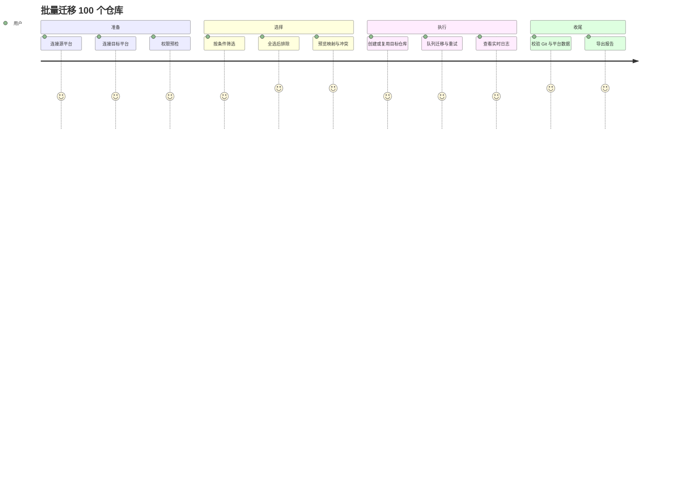

## 摘要

- **核心目标**：让个人开发者、团队管理员和企业研发人员在 Windows 本地安全地把单个或至少 100 个 Git 仓库跨平台迁移到新平台，无需逐个创建目标仓库，也不把代码或平台数据保存到产品服务端。
- **目标用户**：需要更换托管平台的个人开发者、负责组织迁移的团队管理员、企业内部研发人员。
- **关键功能**：平台连接与权限预检；按条件批量发现、全选后排除；自动创建目标仓库并处理空仓库/冲突；Git 数据与可选平台数据迁移；队列、暂停、重试、断点续传和校验报告。
- **技术约束**：第一版为 Windows 可视化桌面应用；迁移数据在本机处理；支持 GitHub、GitLab（含 Self-Managed）、Gitee、Gitea/Forgejo 和通用 SSH/HTTPS Git 服务；未知平台可手动导入 URL；不依赖云端任务存储。
- **优先级**：MVP 必须完成连接、发现/筛选、Git 镜像迁移、目标仓库创建、冲突保护、批量队列和校验；平台专属数据模块按适配器逐步交付。

## 文档信息

- **功能名称**：Git Repo Migrator（Git 仓库迁移工具）
- **版本**：1.0
- **创建日期**：2026-08-26
- **作者**：PM Agent
- **状态**：草稿，供架构、UI、Tech Lead、Scrum Master 使用

## 1. 概述

### 1.1 背景

跨平台迁移通常需要在目标平台预先创建仓库，再逐个复制代码和平台数据。迁移几十到数百个仓库时，手工建库、权限核对和失败追踪会成为主要成本；自建 Git 服务还可能没有标准导入向导。用户希望工具直接在本机完成迁移，私有代码不经过第三方存储。

### 1.2 目标

1. 通过已知平台 API 自动发现仓库，并以权限标签帮助用户选择可迁移范围。
2. 通过筛选条件和“全选后排除”建立批量迁移清单，至少支持 100 个仓库。
3. 自动创建缺失的目标仓库，安全处理空仓库、非空仓库和名称冲突。
4. 默认保留完整 Git 历史、分支、Tag、LFS 和基础仓库元数据；Issues、PR/MR、Wiki、Release 作为独立可选模块。
5. 对每个仓库给出可验证的成功、部分成功、可重试失败或跳过结果。

### 1.3 成功指标

- [ ] 在测试环境中一次任务可载入并处理至少 100 个仓库，目标仓库无需人工逐个创建。
- [ ] Git 数据校验中，迁移仓库的分支和 Tag 引用与源端一致；启用 LFS 时对象数量和可读性校验通过。
- [ ] 非空目标仓库不会在默认策略下被覆盖；每个跳过或失败项都有原因和下一步动作。
- [ ] 迁移中断后恢复任务不会重复创建仓库或破坏已成功完成的仓库。

## 2. 需求穿透分析

### 2.1 用户原始需求

> 我想做一个 git 仓库迁移工具。
>
> 跨平台，并且自己创建的和参与的都能迁移。
>
> 原 git 平台可能是自建的。
>
> 迁移 100 个，手动创建肯定累。
>
> 这个工具不需要他们的代码，也不需要服务端保存什么。

### 2.2 四层需求

**显性需求**

| 需求 | 用户原话 | 解读 |
|---|---|---|
| 跨平台迁移 | “跨平台” | 源、目标可为 GitHub、GitLab、Gitee、Gitea/Forgejo 或通用 Git 服务。 |
| 自有与参与仓库 | “自己创建的和参与的都能迁移” | 必须区分所有权、管理权限、只读参与权限，不能假定参与即有平台数据写权限。 |
| 自建平台 | “原 git 平台可能是自建的” | 已知平台走 API；未知平台至少支持 URL + 凭据的 Git 数据迁移。 |
| 大批量与自动建库 | “迁移 100 个，手动创建肯定累” | 批量筛选、自动创建目标仓库和任务队列是 MVP，而非附加功能。 |
| 本地隐私 | “不需要他们的代码，也不需要服务端保存” | 迁移内容在本机处理，服务端不接收仓库数据。 |

**隐性需求**

| 需求 | 推断依据 | 为什么重要 |
|---|---|---|
| 权限预检与最小权限提示 | 参与仓库可能只有读取权限；目标创建也需组织权限。 | 在执行前暴露不可迁移项，避免半途失败和误授权。 |
| 冲突保护 | 用户明确询问目标已有仓库的处理方式，并接受“空仓库复用、非空跳过”的默认策略。 | 默认覆盖会造成不可逆数据丢失，必须先分类和确认。 |
| 可恢复任务 | 100 个仓库长任务会遇到网络、限流和本机中断。 | 暂停、重试、断点续传决定批量工具是否可用。 |
| 可审计映射与日志 | 跨平台名称、组织和字段并不一一对应。 | 用户需要复核源/目标对应关系及失败原因。 |

**潜在需求**

| 需求 | 洞察来源 | 预期价值 |
|---|---|---|
| 能力降级 | 通用 Git 服务可能没有 API；GitHub/GitLab/Gitea 的平台数据能力不同。 | 无 API 时仍能完成代码迁移，并明确哪些模块未支持。 |
| 迁移后可比对校验 | Git 镜像、LFS、平台数据有不同一致性判断。 | 将“看似完成”变为可验证结果，降低迁移后返工。 |
| 速率限制与并发控制 | 各平台 API/Git 服务都有速率和资源限制。 | 防止批量任务被封禁或耗尽本机资源。 |
| 凭据生命周期管理 | 本地工具仍会处理令牌、SSH Key 和自签名证书。 | 凭据泄露会造成源、目标平台双重风险。 |

**惊喜需求**

| 需求 | 创新点 | 预期反应 |
|---|---|---|
| 全选后排除 | 用户先用组织/更新时间/可见性筛选全部仓库，再排除少量例外。 | “不用勾一百次就能精确控制范围。” |
| 迁移预演报告 | 不执行写入，仅展示创建、复用、跳过、改名、权限不足和不支持模块。 | “先看清影响范围，再放心开始。” |
| 跨平台字段映射预览 | 在迁移前展示简介、Topics、默认分支和可见性如何映射。 | “知道项目介绍迁过去会变成什么。” |

### 2.3 优先级矩阵

| 优先级 | 需求 | 用户价值 | 实现成本 | 决策依据 |
|---|---|---:|---:|---|
| P0 | 平台连接、凭据测试与权限预检 | 高 | 中 | 是所有迁移路径的前置，失败会阻断全流程。 |
| P0 | 仓库发现、筛选、全选后排除与映射 | 高 | 中 | 直接解决 100 个仓库的选择成本。 |
| P0 | Git 历史/分支/Tag/LFS 迁移与校验 | 高 | 中 | 迁移工具的核心价值，缺失即无法交付。 |
| P0 | 自动创建目标仓库与冲突保护 | 高 | 中 | 消除手工建库，同时保护已有数据。 |
| P0 | 队列、暂停、重试、断点和报告 | 高 | 高 | 批量任务必需；成本高但不具备则无法支持长任务。 |
| P1 | 基础元数据迁移 | 高 | 中 | 用户已确认希望迁移项目介绍；平台 API 映射存在差异。 |
| P1 | Issues、PR/MR、Wiki、Release 模块 | 中高 | 高 | 价值高但平台差异和权限复杂，按适配器交付。 |
| P1 | 覆盖迁移与继续同步 | 中高 | 高 | 有明确场景但风险高，默认关闭并二次确认。 |
| P2 | CLI、定时任务、更多平台 | 中 | 高 | 底层引擎预留能力，非 Windows GUI MVP 必需。 |
| P2 | 自动生成迁移后重定向/链接修复建议 | 中 | 中 | 属于惊喜能力，先输出检测结果而不自动改代码。 |

## 3. 竞品调研

调研时间：2026-08-26。以下结论来自公开文档和开源项目说明，未将未验证的宣传口径作为事实。

| 竞品 | 核心功能 | 用户体验亮点 | 用户痛点/限制 | 我们的机会 |
|---|---|---|---|---|
| [GitHub Importer](https://docs.github.com/en/migrations/importing-source-code/using-github-importer/importing-a-repository-with-github-importer) | 从其他 Git 托管服务导入单个仓库到 GitHub。 | 目标平台内置，配置步骤短。 | 以 GitHub 为目标，不能作为任意跨平台批量迁移控制台；平台专属数据范围受限。 | 本地执行、任意源/目标适配器、批量预检和断点任务。 |
| [GitHub 镜像复制文档](https://docs.github.com/en/repositories/creating-and-managing-repositories/duplicating-a-repository) | 使用镜像克隆和镜像推送复制完整 Git 引用。 | Git 历史和引用语义清晰。 | 需要用户自己准备目标仓库和命令行流程；不处理跨平台元数据。 | GUI 化镜像流程、自动建库、冲突分类和校验报告。 |
| [GitLab Import/Export](https://docs.gitlab.com/user/project/settings/import_export/) | 项目/组导出导入，可包含多类项目数据，并有大项目和限流说明。 | 对 GitLab 内部数据覆盖较广。 | 主要围绕 GitLab 数据格式和 GitLab 目标；跨平台字段映射需人工处理。 | 统一内部迁移清单，按能力降级到 Git 数据，明确不支持项。 |
| [Gitea API](https://docs.gitea.com/api/1.24/) | 提供仓库、分支、Tag、Release、Issue、Pull Request 等 API。 | 自建实例可通过同一 API 体系管理。 | 不同版本/实例配置会影响可用能力；需管理员令牌和目标创建权限。 | 支持自建地址、连接测试、API 能力探测和逐模块结果。 |
| [ghorg](https://github.com/gabrie30/ghorg) | 支持 GitHub/GitLab/Gitea 等平台批量克隆、筛选、备份、Wiki 和子模块选项。 | 过滤器、备份和多平台 CLI 能力成熟。 | 重点是拉取/备份到本地，不是跨平台目标建库与平台数据写入；命令行对普通用户门槛较高。 | 在本地执行基础上提供 Windows GUI、目标映射、自动建库、写入和审计报告。 |

### 3.1 差异化策略

| 维度 | 竞品常见做法 | 本产品做法 | 差异化价值 |
|---|---|---|---|
| 数据路径 | 平台内导入或用户脚本传输 | 本机直接连接源和目标，产品服务端不保存仓库数据 | 适合私有仓库和企业内网迁移。 |
| 批量选择 | 命令行过滤或平台内单次导入 | 条件筛选、全选后排除、映射清单预览 | 100+ 仓库无需逐个勾选。 |
| 目标创建 | 用户预先创建或仅导入到单一平台 | 目标 API 自动创建；空仓库复用、非空跳过、冲突改名 | 减少人工建库且避免覆盖。 |
| 结果可信度 | 命令执行成功即结束 | 分支/Tag/LFS/平台数据逐项校验并分类 | 迁移完成可审计、可重试。 |

## 4. 用户画像

### 用户画像 1：企业迁移负责人

| 属性 | 描述 |
|---|---|
| 角色 | 研发经理、平台管理员或资深开发者 |
| 特征 | 管理多个组织/项目，能获取源和目标平台令牌；需要在 Windows 上执行一次性迁移。 |
| 需求 | 批量发现仓库、自动建库、保留历史与元数据、掌握失败项。 |
| 痛点 | 手工创建 100 个仓库、权限不一致、平台字段不兼容、任务中断后难以恢复。 |
| 期望 | 先预检再执行；默认不破坏目标已有数据；结果有映射、日志和校验证据。 |

### 用户画像 2：个人开发者

| 属性 | 描述 |
|---|---|
| 角色 | 同时使用多个公有平台或自建 Git 服务的开发者 |
| 特征 | 仓库数量较少但可能包含私有仓库和 LFS；不希望上传代码。 |
| 需求 | 通过 GUI 配置两个平台，迁移单仓库或少量仓库。 |
| 痛点 | 不熟悉镜像命令和令牌权限；担心误覆盖目标仓库。 |
| 期望 | 连接测试、权限提示、默认安全策略和清晰的错误指引。 |

### 用户旅程

## 5. 功能需求

### FR-001：连接平台与凭据测试

- **描述**：系统必须允许用户配置 GitHub、GitLab、Gitee、Gitea/Forgejo 或通用 Git 服务的地址与认证方式，并在保存前测试连接。
- **用户价值**：确认地址、令牌和网络可用，减少批量任务中途失败。
- **优先级**：P0（价值高、成本中；所有路径的前置条件）。
- **需求来源**：显性 + 隐性。
- **验收标准**：
  - [ ] Given 用户输入平台地址和有效令牌，When 点击“测试连接”，Then 在 10 秒内显示平台识别、账号/实例身份和可用权限摘要。
  - [ ] Given 地址不可达、证书不受信或令牌无效，When 点击“测试连接”，Then 不保存明文凭据并显示可操作错误原因。
  - [ ] Given 用户选择通用 Git 服务，When 输入 SSH 或 HTTPS 仓库 URL，Then 系统允许跳过 API 发现并进入手动 URL 导入。
- **边界情况**：自签名证书必须显式选择是否信任；网络超时可重试；不显示完整令牌内容。

### FR-002：仓库自动发现与权限分级

- **描述**：对支持 API 的平台，系统必须列出用户可见的自有、管理和参与仓库，并标记“可完整迁移”“仅 Git 数据”“权限不足”。
- **用户价值**：用户无需逐个复制 URL，并能在执行前理解权限边界。
- **优先级**：P0（价值高、成本中）。
- **需求来源**：显性 + 隐性。
- **验收标准**：
  - [ ] Given API 账号有仓库列表权限，When 用户选择账号或组织并刷新，Then 列表显示仓库名称、可见性、更新时间、角色和可用迁移模块。
  - [ ] Given 用户仅有参与仓库的读取权限，When 查看该仓库，Then 系统标记为“仅 Git 数据”或“权限不足”，不承诺迁移 Issues/PR。
  - [ ] Given API 返回分页结果，When 用户加载更多，Then 不重复且最终数量与平台返回总数一致或明确显示受限原因。
- **边界情况**：API 不支持发现时显示手动导入入口；空组织显示空态和检查权限提示；部分仓库接口失败不隐藏已获取结果。

### FR-003：条件筛选、全选后排除与映射清单

- **描述**：系统必须支持按账号/组织、名称、可见性、更新时间和权限筛选，支持选择全部筛选结果后排除例外，并保存源到目标的映射。
- **用户价值**：一次选择大批仓库，避免手动勾选 100 个条目。
- **优先级**：P0（价值高、成本中）。
- **需求来源**：显性 + 惊喜。
- **验收标准**：
  - [ ] Given 列表有 100 个仓库，When 设置“组织=A、更新时间=近一年”并点击“全选结果”，Then 选择计数等于筛选结果数而非当前分页数。
  - [ ] Given 已全选筛选结果，When 排除 `demo-*` 和指定仓库，Then 预览只包含剩余仓库并显示排除原因。
  - [ ] Given 用户设置目标组织、命名规则和可见性，When 生成映射，Then 每个源仓库有唯一目标 URL/名称，冲突在预检阶段标出。
  - [ ] Given 用户导入 CSV 或 URL 文本，When 文件含重复或无效行，Then 系统逐行报告并仅保留有效唯一 URL。
- **边界情况**：筛选结果为空时禁止开始迁移；目标名称超过平台限制时预检报错并给出改名建议。

### FR-004：迁移前预检与计划预览

- **描述**：系统必须在任何写入操作前检查源读取权限、目标创建/写入权限、目标仓库状态、命名冲突、平台模块支持、网络和磁盘可用性，并生成预览。
- **用户价值**：在付出迁移成本前知道哪些仓库会创建、复用、跳过、改名或降级。
- **优先级**：P0（价值高、成本中）。
- **需求来源**：隐性 + 惊喜。
- **验收标准**：
  - [ ] Given 映射清单已生成，When 用户点击“预检”，Then 每个仓库显示计划动作、权限结果、冲突、选定模块和阻断原因。
  - [ ] Given 存在非空目标仓库，When 采用默认策略，Then 计划动作是“跳过”且不会发起覆盖写入。
  - [ ] Given 某平台不支持 Issues 迁移，When 用户勾选该模块，Then 预检将其标为“不支持”并允许继续 Git 数据迁移。
  - [ ] Given 预检存在阻断项，When 用户点击开始，Then 系统只允许修正或排除阻断项后执行，不静默跳过。
- **边界情况**：预检期间源状态变化需在执行前再次确认；目标权限不足时禁止自动创建。

### FR-005：自动创建与目标仓库冲突策略

- **描述**：目标仓库不存在时，系统必须按用户配置自动创建；空仓库默认复用；非空仓库默认跳过；名称冲突可按规则改名。覆盖和继续同步必须显式开启并二次确认。
- **用户价值**：免除逐个建库，同时避免误删或覆盖已有项目。
- **优先级**：P0（价值高、成本中）。
- **需求来源**：显性 + 隐性。
- **验收标准**：
  - [ ] Given 目标路径不存在且账号有创建权限，When 任务开始，Then 创建目标仓库并记录目标 ID、名称和创建结果。
  - [ ] Given 目标仓库存在但无提交，When 默认策略执行，Then 复用该仓库而不重复创建。
  - [ ] Given 目标仓库存在且有提交，When 默认策略执行，Then 跳过该仓库并在报告中列出 URL、状态和原因。
  - [ ] Given 名称冲突且启用改名规则，When 预检生成计划，Then 目标名称唯一、符合平台命名约束并在用户确认前展示。
  - [ ] Given 用户启用覆盖，When 二次确认未完成，Then 系统不得删除、强推或替换任何目标引用。
- **边界情况**：目标 API 创建成功但后续网络中断时，恢复任务必须识别已创建仓库而非再次创建；无创建 API 时提供“手动创建后重新预检”。

### FR-006：Git 数据迁移

- **描述**：系统必须默认迁移完整提交历史、所有分支和 Tag；用户启用时迁移 Git LFS；保留 Submodule 配置但不隐式复制用户无权访问的子仓库。
- **用户价值**：保留项目历史和构建依赖，避免迁移后丢失引用。
- **优先级**：P0（价值高、成本中）。
- **需求来源**：显性。
- **验收标准**：
  - [ ] Given 源仓库可读且目标可写，When Git 模块完成，Then 目标分支和 Tag 名称集合与源一致，且每个分支最新提交哈希一致。
  - [ ] Given 用户启用 LFS，When 迁移完成，Then 目标端每个源 LFS 对象可下载读取，缺失对象列为失败而非成功。
  - [ ] Given 仓库含 Submodule，When 迁移完成，Then `.gitmodules` 和提交中的引用保持不变，并在报告中列出未迁移的外部仓库。
  - [ ] Given 源仓库只有读取权限，When 平台数据模块需要写入权限，Then Git 模块仍可执行，平台模块单独降级。
- **边界情况**：大仓库或单文件超限时按平台错误重试并保留失败阶段；源分支在任务期间新增时在报告中提示需要再次同步。

### FR-007：基础仓库元数据迁移

- **描述**：系统必须默认迁移仓库简介、项目主页、Topics/Tags、默认分支和可配置的可见性；README、License 等仓库文件随 Git 数据迁移。
- **用户价值**：目标仓库在迁移后仍能被正确介绍、搜索和打开默认代码。
- **优先级**：P1（价值高、成本中）。
- **需求来源**：显性 + 隐性。
- **验收标准**：
  - [ ] Given 源平台返回简介、主页和 Topics，When 元数据模块成功，Then 目标平台字段与映射预览一致，并在报告中记录未映射字段。
  - [ ] Given 用户未开启可见性变更，When 迁移执行，Then 目标可见性保持创建时配置，不被源值覆盖。
  - [ ] Given 默认分支名称在目标不存在，When Git 数据迁移完成，Then 系统选择源默认分支对应的目标引用；无法设置时报告人工步骤。
- **边界情况**：目标平台不支持 Topics 或主页字段时只记录不支持，不阻断 Git 迁移；内容超长时按目标限制截断并提示。

### FR-008：可选平台数据模块

- **描述**：Issues、PR/MR、Wiki、Release 及附件必须以独立可勾选模块提供；系统按源/目标适配器能力执行并分别报告数量和失败项。
- **用户价值**：用户可按迁移目的选择数据范围，不因某个平台模块不可用而放弃代码迁移。
- **优先级**：P1（价值中高、成本高）。
- **需求来源**：显性 + 潜在。
- **验收标准**：
  - [ ] Given 用户只勾选 Git 和 Wiki，When 任务执行，Then Issues、PR/MR、Release 不产生写入，报告标记为“未选择”。
  - [ ] Given 源和目标均支持 Issue API，When 模块成功，Then 报告显示源/目标数量、映射关系和失败条目。
  - [ ] Given 目标平台不支持某模块或用户权限不足，When 预检执行，Then 该模块标记为“不支持/权限不足”，其他模块仍可继续。
  - [ ] Given 附件下载失败，When 重试次数耗尽，Then 仓库结果为“Git 数据成功但平台数据部分失败”，并给出附件 URL。
- **边界情况**：作者、评论者或成员在目标不存在时使用明确的匿名/原文策略并记录；不伪造不存在的用户身份。

### FR-009：批量任务队列与恢复

- **描述**：系统必须以队列执行至少 100 个仓库，提供并发上限、暂停、继续、取消、失败重试和断点续传；单个仓库失败不得阻断其他仓库。
- **用户价值**：长任务可控、可恢复，网络抖动不会导致整批重做。
- **优先级**：P0（价值高、成本高；批量场景不可缺）。
- **需求来源**：显性 + 潜在。
- **验收标准**：
  - [ ] Given 任务包含 100 个仓库，When 开始执行，Then 队列显示每仓库阶段、状态、重试次数和总体进度。
  - [ ] Given 用户点击暂停，When 当前仓库完成安全检查点，Then 新仓库不再启动，已运行仓库按可中断阶段停止并显示“已暂停”。
  - [ ] Given 单仓库网络失败，When 达到配置的重试次数，Then 该仓库标为“可重试失败”，队列继续处理其他仓库。
  - [ ] Given 应用关闭后重新打开任务，When 用户选择继续，Then 已完成阶段不重复写入，未完成阶段从最近检查点继续。
- **边界情况**：磁盘空间不足、API 限流、系统休眠和网络切换都要暂停受影响项并给出恢复条件；取消任务必须保留已完成结果。

### FR-010：校验、报告与导出

- **描述**：系统必须在每个仓库和批次结束后校验 Git 引用、LFS（若启用）、基础元数据和所选平台数据，展示分类结果并可导出报告与映射清单。
- **用户价值**：用户能证明迁移是否完整，并把失败项交给后续处理。
- **优先级**：P0（价值高、成本中）。
- **需求来源**：隐性 + 潜在。
- **验收标准**：
  - [ ] Given Git、LFS 和所选模块均通过校验，When 批次结束，Then 仓库状态为“完整成功”。
  - [ ] Given Git 通过但平台数据有失败，When 批次结束，Then 状态为“Git 数据成功但平台数据部分失败”，并列出失败模块和原因。
  - [ ] Given 权限不足或目标冲突，When 预检/执行结束，Then 状态为“权限或冲突跳过”，不与网络失败混淆。
  - [ ] Given 用户点击导出，When 选择 JSON 或 CSV，Then 文件包含源 URL、目标 URL、动作、状态、错误代码、时间和校验摘要，且不含令牌值。
- **边界情况**：校验接口受限时报告“无法验证”而非误报成功；报告写入失败时提示选择其他本地目录。

### FR-011：安全凭据与本地数据生命周期

- **描述**：系统必须将令牌、密码和私钥引用保存到 Windows 安全凭据存储或用户选择的安全机制，日志脱敏，并在任务完成/取消后按策略清理临时数据。
- **用户价值**：本地执行不变成凭据和代码泄露源。
- **优先级**：P0（价值高、成本中）。
- **需求来源**：隐性。
- **验收标准**：
  - [ ] Given 用户保存平台连接，When 查看配置和日志，Then 不出现完整令牌、密码或私钥内容。
  - [ ] Given 任务完成或取消，When 清理策略执行，Then 临时克隆目录按配置删除或保留，并显示清理结果。
  - [ ] Given 用户删除连接，When 确认删除，Then 本地凭据引用被移除，后续任务要求重新认证。
  - [ ] Given 产品未配置云端服务，When 执行迁移，Then 网络请求仅发往用户指定的源/目标平台及用户主动启用的更新地址。
- **边界情况**：清理失败时显示路径和手动删除指引；用户选择保留临时目录时必须在报告中标记其位置。

### FR-012：通用 Git 服务手动导入

- **描述**：对无 API 或未识别的自建服务，系统必须允许用户输入单个或批量 SSH/HTTPS 仓库 URL、认证方式和目标映射，至少完成 Git 数据迁移和校验。
- **用户价值**：不因自研平台没有标准 API 而无法迁移代码。
- **优先级**：P0（价值高、成本中）。
- **需求来源**：显性 + 潜在。
- **验收标准**：
  - [ ] Given 用户导入有效 URL 列表，When 解析并测试连接，Then 系统识别仓库可读性并生成唯一映射。
  - [ ] Given 通用服务无仓库创建 API，When 预检完成，Then 系统明确要求用户预先创建或提供创建脚本，不声称已自动建库。
  - [ ] Given 目标 Git URL 可写，When 执行 Git 模块，Then 完成与已知平台相同的分支、Tag 和提交校验。
- **边界情况**：URL 无效、SSH Host Key 未确认、HTTP 认证失败和自签名证书都必须逐条报错；不自动关闭 TLS 校验。

## 6. 非功能需求

### NFR-001：性能与容量

- GUI 首屏在普通 Windows 11 开发机上冷启动后 5 秒内可交互；筛选 1,000 条仓库记录时交互反馈不超过 300ms（本地已加载数据）。
- 队列至少可容纳 100 个仓库；并发数可配置且默认值不得导致 UI 无响应。
- 日志和报告写入不能阻塞迁移主任务超过 1 秒；大文件迁移显示已传输字节和速率。

### NFR-002：可靠性与可恢复性

- 每个仓库至少在“预检、目标准备、Git、LFS、元数据、平台模块、校验”阶段保存检查点。
- 应用异常退出后，重启并选择继续时，已成功阶段不重复执行破坏性写入。
- 任务状态、错误代码和映射清单在本地可读取；产品不依赖远程服务恢复任务。

### NFR-003：安全与隐私

- 默认不上传仓库内容、提交历史、Issues、PR 或报告到产品服务端；产品不提供云端迁移队列。
- 凭据只通过系统安全存储或短期内存使用；日志、崩溃信息和导出报告不得包含令牌、密码、私钥。
- 覆盖迁移、可见性变更和信任自签名证书默认关闭，执行前要求明确确认并显示影响范围。

### NFR-004：可用性与可访问性

- 核心流程必须能通过“连接→选择→预检→执行→报告”五步完成；每一步可返回上一步修改配置。
- 所有阻断错误提供原因、受影响仓库和建议动作；空态、分页、限流、权限不足和取消状态有独立文案。
- UI 不要求用户阅读命令行；高级用户可从报告获得足够信息进行手动修复。

### NFR-005：兼容性

- 第一版支持 Windows 10 22H2 及 Windows 11 的 64 位版本（该范围为产品假设，发布前需在 CI/实机验证）。
- Git over HTTPS、SSH 和 Git LFS 的行为应与系统 Git 客户端兼容；不强制特定平台的服务器版本。

## 7. 用户故事

### US-001：批量迁移组织仓库

- **作为** 企业迁移负责人
- **我想要** 按组织、更新时间和可见性筛选后全选仓库并排除例外
- **以便** 一次迁移 100 个仓库而不逐个勾选
- **验收标准**：筛选计数准确；排除项不进入执行计划；计划可导出复核。
- **优先级**：P0

### US-002：安全处理已有目标仓库

- **作为** 团队管理员
- **我想要** 在目标仓库已存在时看到空/非空和同仓判断，并默认跳过非空仓库
- **以便** 批量迁移不会覆盖同事已有代码
- **验收标准**：非空目标默认无写入；覆盖必须二次确认；报告包含冲突原因。
- **优先级**：P0

### US-003：迁移无 API 的自建 Git 服务

- **作为** 使用企业自研 Git 服务的开发者
- **我想要** 手动输入仓库 URL 并迁移 Git 历史
- **以便** 不依赖平台是否实现导入 API
- **验收标准**：有效 SSH/HTTPS URL 可完成 Git 迁移和校验；平台数据能力明确标记不可用。
- **优先级**：P0

### US-004：恢复中断的批量任务

- **作为** 执行长时间迁移的管理员
- **我想要** 暂停、关闭应用后再继续，并只重试失败仓库
- **以便** 网络或电脑重启不会迫使我从头开始
- **验收标准**：恢复后已完成仓库不重复覆盖；失败仓库可单独重试；最终报告保留历史尝试。
- **优先级**：P0

### US-005：选择性迁移平台数据

- **作为** 需要保留项目上下文的团队管理员
- **我想要** 独立选择 Issues、PR/MR、Wiki、Release 和附件
- **以便** 按目标平台能力和合规要求控制数据范围
- **验收标准**：未勾选模块不写入；不支持模块不阻断 Git；每个模块有数量对照。
- **优先级**：P1

## 8. 成功指标

| 指标类型 | 指标 | 目标值 | 衡量方式 |
|---|---|---:|---|
| 核心指标 | 单批次可处理仓库数 | ≥100 | 自动化集成测试加载 100 个仓库计划并完成队列调度。 |
| 核心指标 | Git 引用校验通过率 | 100%（对报告为成功的仓库） | 对分支/Tag 最新提交哈希进行源目标比对。 |
| 核心指标 | 默认冲突保护 | 0 次未确认覆盖 | 测试非空目标仓库执行默认策略，审计日志无破坏性写入。 |
| 可靠性指标 | 中断恢复正确率 | 100%（测试样本） | 在各阶段强制退出后恢复，比较已完成阶段和最终校验。 |
| 体验指标 | 预检覆盖率 | 100% 的执行仓库有预检结果 | 检查任务记录是否包含权限、冲突和模块能力结论。 |
| 隐私指标 | 产品服务端仓库数据接收量 | 0 | 网络审计仅允许用户指定平台和明确更新地址。 |

## 9. 范围定义

### 9.1 本期范围（In Scope）

- Windows GUI：平台连接、凭据测试、仓库发现、手动 URL 导入、筛选、全选后排除和映射。
- GitHub、GitLab（含 Self-Managed）、Gitee、Gitea/Forgejo 的 API 发现与目标创建；通用 Git SSH/HTTPS 数据迁移。
- 完整 Git 历史、分支、Tag、可选 LFS、Submodule 配置检查。
- 仓库简介、主页、Topics/Tags、默认分支等基础元数据迁移。
- Issues、PR/MR、Wiki、Release 及附件的可选适配器模块和能力报告。
- 预检、空/非空/冲突策略、队列、并发控制、暂停、恢复、重试、断点、校验和本地报告。
- Windows 凭据保护、日志脱敏、临时文件清理和离线本地执行。

### 9.2 范围外（Out of Scope）

- macOS/Linux GUI：第一版聚焦 Windows 安装、凭据和文件系统兼容性。
- 无 API 自建平台的 Issues、PR/MR 等专属数据：缺少稳定协议无法承诺跨平台语义一致性，第一版仅保证 Git 数据。
- 自动绕过所有权、组织策略、分支保护或平台限流：工具必须遵守源/目标权限。
- 默认删除、清空或强制覆盖目标仓库：高风险操作只在用户显式启用并二次确认时出现。
- 云端托管、远程无人值守迁移和产品服务端保存任务：与本地隐私定位冲突。
- 自动迁移 CI/CD 密钥、环境变量、部署凭据、Packages/容器镜像和外部工单系统：数据敏感且跨平台语义不统一。
- 第一版 CLI、定时任务和企业集中策略管理：底层引擎保留复用边界，产品交付以 GUI 为准。

## 10. 风险与依赖

### 10.1 风险登记

| 风险 | 可能性 | 影响 | 缓解措施 |
|---|---|---|---|
| 平台 API 版本、权限和限流差异 | 高 | 高 | 连接时探测能力；模块化执行；退避重试；报告区分不支持与失败。 |
| 跨平台用户、评论、Issue 状态无法一一映射 | 高 | 中高 | 不伪造身份；建立字段映射；逐模块统计；无法映射项保留原文或链接。 |
| 非空目标仓库误覆盖 | 中 | 高 | 默认跳过；执行前预检；覆盖开关关闭；二次确认并记录影响范围。 |
| 大仓库/LFS 占满磁盘或耗时过长 | 中 | 高 | 预检估算磁盘；可配置临时目录；阶段检查点；支持暂停和清理。 |
| 自签名证书或 SSH Host Key 被错误信任 | 中 | 高 | 显式确认并持久化指纹；默认不关闭 TLS/Host Key 校验。 |
| 源仓库在迁移期间继续变更 | 中 | 中 | 记录源引用快照和时间；校验后提示再次同步；不宣称实时镜像。 |
| 平台创建 API 不可用或组织策略禁止建库 | 中 | 高 | 预检提前阻断；提供手动创建后重新检查；不假设管理员权限。 |

### 10.2 依赖项

| 依赖项 | 类型 | 状态 | 负责人 |
|---|---|---|---|
| 系统 Git 与 Git LFS 客户端 | 技术 | 需在架构阶段确定打包/检测策略 | Architect/Tech Lead |
| GitHub、GitLab、Gitee、Gitea/Forgejo API 和令牌权限 | 外部 | 可用但随平台版本变化 | Backend |
| Windows 凭据存储和文件系统权限 | 技术 | 可用，需兼容性验证 | Architect/DevOps |
| 各平台测试账号、组织和仓库样本 | 外部 | 需准备测试夹具 | QA/PM |
| 自签名证书、SSH 和 LFS 集成测试环境 | 外部 | 需准备企业内网样本 | QA |

## 11. 里程碑

| 里程碑 | 内容 | 目标日期 |
|---|---|---|
| MVP-1 连接与选择 | Windows 壳、平台连接、凭据测试、API 发现、手动 URL、筛选和映射 | - |
| MVP-2 Git 迁移 | 目标创建、空/非空冲突策略、镜像迁移、LFS、分支/Tag 校验 | - |
| MVP-3 批量可靠性 | 队列、并发、暂停/恢复、重试、断点和报告导出 | - |
| V1.0 元数据与适配器 | 基础元数据、GitHub/GitLab/Gitea 平台数据模块、权限降级 | - |
| V1.1 扩展 | 覆盖/继续同步增强、更多平台、CLI 和自动化能力评估 | - |

## 12. 开放问题与产品决策边界

以下事项不阻塞 MVP，但必须在对应阶段形成可追溯决策：

1. **Windows 支持基线**：本 PRD 以 Windows 10 22H2/Windows 11 64 位为假设；发布前由 DevOps 在安装、凭据、SSH、LFS 和代理环境中验证，若不成立则收窄支持声明。
2. **平台专属数据映射**：不同平台的作者、评论者、状态和附件权限不等价；V1.0 采用“可映射则迁移、不可映射保留原文/链接、禁止伪造身份”的规则。
3. **继续同步语义**：V1.0 仅保证从检查点继续当前任务；跨多次任务的增量同步需先定义源快照、删除策略和冲突解决规则，V1.1 再评估。
4. **备份策略**：覆盖迁移默认关闭；若用户启用，架构阶段必须确定本地镜像备份位置、保留期和恢复步骤后才能开放开关。

## 变更记录

| 版本 | 日期 | 作者 | 变更内容 |
|---|---|---|---|
| 1.0 | 2026-08-26 | PM Agent | 基于设计简报完成需求穿透、竞品调研、功能/非功能需求和验收标准。 |
