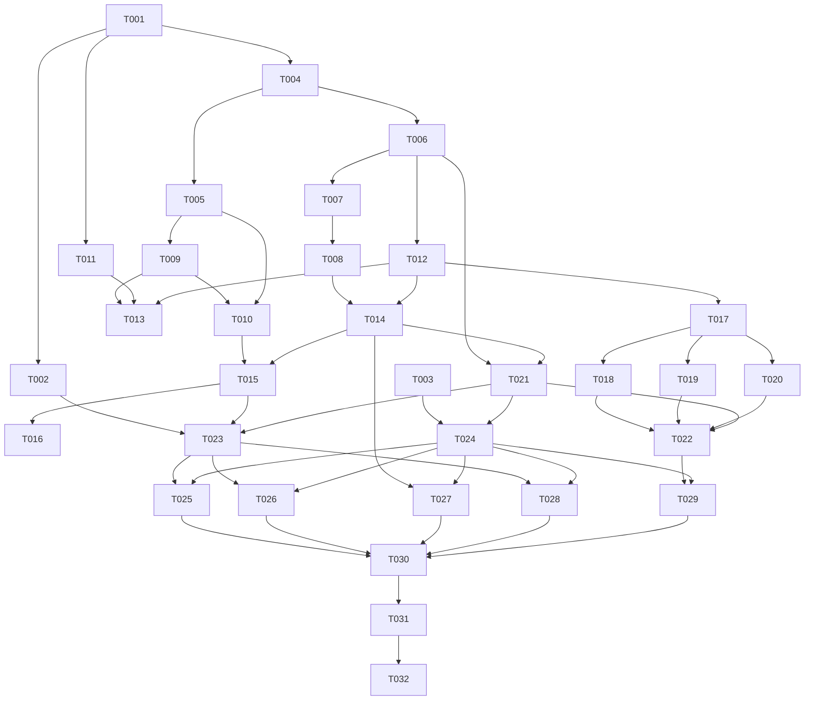

# 开发任务规格文档

## 文档信息

- **功能名称**：Git Repo Migrator
- **版本**：1.0
- **创建日期**：2026-08-26
- **作者**：Scrum Master Agent
- **关联产物**：`prd.md`、`architecture.md`、`ui-spec.md`、`ui-design.json`、`tech-review.md`

## 摘要

> 下游 Agent 先读本节、Repo Preflight、依赖图和所属 Evidence Wave，再执行单个任务。

- **任务总数**：32
- **前端任务**：7（T-003、T-024 至 T-029）
- **后端/共享任务**：22（T-001、T-002、T-004 至 T-023）
- **QA/DevOps 任务**：3（T-030 至 T-032）
- **关键路径**：T-001 → T-004 → T-006 → T-008 → T-012 → T-014 → T-022 → T-023 → T-029 → T-030 → T-032
- **总预估工具调用**：约 142 次；关键路径累计约 61 次
- **预估复杂度**：高
- **Blast Radius**：高，计划创建约 90 个工程、测试、迁移和 CI 文件，覆盖依赖、认证、持久化、队列、路由与发布链路
- **风险确认触发项**：需确认。命中写入文件数 ≥10、依赖清单/锁文件、依赖安装、SQLite migration、凭据与权限、任务队列/全局状态/路由、CI 与签名安装包配置
- **实现授权边界**：本产物仅为规划；进入 code 阶段前必须向用户展示 Blast Radius 并取得确认

## 0. Repo Preflight 摘要

| 事实 | 发现结果 | 证据命令/文件 |
|---|---|---|
| 仓库内容 | 仅存在 `.boss/git-repo-migrator/*` 规划产物；业务工程未初始化 | `Get-ChildItem D:\Desktop\chang\www\git-repo-migrator -Force` |
| Git 仓库 | not initialized；默认分支、当前分支、remote 均为 `unknown` | `git -C D:\Desktop\chang\www\git-repo-migrator status --short --branch` |
| Rust 工具链 | not installed；`cargo`/`rustc` 当前不可用 | 环境探测记录；实现前执行 `cargo --version`、`rustc --version` |
| Node | 已发现 `22.17.0` | `node --version` |
| npm | 当前 Volta 安装异常，依赖安装能力不可用 | 环境探测记录；实现前执行 `npm --version` |
| Git/Git LFS | Git `2.55.0.windows.5`；Git LFS `3.7.1` | `git --version`、`git lfs version` |
| CI 命令 | `unknown / not initialized` | `.github/workflows/*`、`.gitlab-ci.yml` 不存在 |
| 测试脚本 | `unknown / not initialized` | `package.json`、`Cargo.toml` 不存在 |
| Integration/E2E 覆盖 | `unknown / not initialized` | `tests/` 与 Playwright 配置不存在 |
| schema enum 来源 | `unknown / not initialized`；计划由 Rust `domain` 类型定义为唯一来源 | `crates/domain/src/*` 尚不存在 |
| 业务常量 | `unknown / not initialized`；并发、重试、lease、refs、冲突策略需集中定义 | 工程文件尚不存在 |
| 访问控制入口 | 本地桌面无产品登录；Tauri command 白名单、Credential Manager、目标平台权限尚未初始化 | `apps/desktop/src-tauri/*` 尚不存在 |
| 路由约定 | `unknown / not initialized`；计划路由为 `/connections`、`/repositories`、`/mapping`、`/preflight`、`/queue`、`/report` | `ui-design.json`、未来 `apps/desktop/src/router.tsx` |
| migration 风险 | 高；首次 SQLite schema、append-only checkpoint、lease 和保留策略均未实现 | `migrations/`、`crates/local-store/` 尚不存在 |

### 实现前环境门禁

- [ ] 安装并固定 Rust stable、Cargo、MSVC Build Tools 和 WebView2 运行时。
- [ ] 修复 npm/Volta，确认 `npm ci` 可用；不得在 npm 不可复现时生成或手改锁文件。
- [ ] 初始化 Git 后确认默认分支和提交规范。
- [ ] 锁定“系统 Git/LFS 检测”还是“安装包内置”决策；未决时不得进入签名发布 Wave。
- [ ] 确认 GitHub/GitLab/Gitee/Gitea 测试实例或录制夹具不含真实 token。

## 1. Blast Radius 与风险确认

| 指标 | 结论 | 强制确认 |
|---|---|---|
| 计划写入文件数 | 约 90 个 | 是 |
| 核心模块 | domain、SQLite、GitRunner、凭据、平台 API、队列、IPC、全局路由 | 是 |
| 依赖清单/锁文件 | `Cargo.toml`、`Cargo.lock`、`package.json`、`package-lock.json`、各 crate manifest | 是 |
| 依赖安装命令 | `rustup`/系统安装、`cargo fetch`、`npm ci` | 是 |
| 数据模型/migration | 首次 SQLite schema 与后续 migration 策略 | 是 |
| 权限/危险写操作 | 目标建库、可见性、继续同步、覆盖、外部创建脚本 | 是 |
| 删除文件/远端数据 | 计划不删除本地文件；默认不删除目标 refs；覆盖能力后续单独确认 | 覆盖启用时再次确认 |

## 2. 任务详情

### Wave 1：工程骨架与领域契约

#### Task T-001 [SHARED]：初始化 Rust workspace 与工具链约束

**Owner**：backend；**复杂度/调用**：中 / 4；**依赖**：无；**并行安全组**：G1-A

| 文件路径 | 操作 | 写集风险 | owner | 说明 |
|---|---|---|---|---|
| `Cargo.toml` | 创建 | 共享文件 | T-001 | workspace members、统一 edition/lints/dependencies |
| `Cargo.lock` | 生成 | 共享锁文件 | T-001 | 只由 `cargo generate-lockfile/fetch` 生成 |
| `rust-toolchain.toml` | 创建 | 共享配置 | T-001 | 固定 stable channel、rustfmt、clippy |

实现与验收：建立 workspace，不放业务逻辑；`cargo metadata --no-deps` 可解析；`cargo fmt --all -- --check` 可运行。不得由其他任务并发修改根 manifest/lock。

#### Task T-002 [SHARED]：初始化 Tauri 原生壳与最小安全能力

**Owner**：backend；**复杂度/调用**：中 / 5；**依赖**：T-001；**并行安全组**：G1-B

| 文件路径 | 操作 | 写集风险 | owner | 说明 |
|---|---|---|---|---|
| `apps/desktop/src-tauri/Cargo.toml` | 创建 | 独占 | T-002 | Tauri crate 依赖与 workspace 引用 |
| `apps/desktop/src-tauri/tauri.conf.json` | 创建 | 发布共享配置 | T-002 | Windows bundle、窗口、CSP、导航限制 |
| `apps/desktop/src-tauri/capabilities/default.json` | 创建 | 权限核心 | T-002 | 最小 command/file/dialog capability 白名单 |

实现与验收：默认禁止 shell、任意文件读写和任意外部导航；仅声明后续受控 command。测试 `cargo check -p git-repo-migrator-desktop`，并以 schema 校验 Tauri 配置。

#### Task T-003 [FE]：初始化 React/TypeScript 工具链

**Owner**：frontend；**复杂度/调用**：中 / 5；**依赖**：无；**并行安全组**：G1-A

| 文件路径 | 操作 | 写集风险 | owner | 说明 |
|---|---|---|---|---|
| `apps/desktop/package.json` | 创建 | 共享依赖清单 | T-003 | React、Vite、测试、Tauri scripts |
| `apps/desktop/package-lock.json` | 生成 | 共享锁文件 | T-003 | 只由修复后的 npm 生成 |
| `apps/desktop/tsconfig.json` | 创建 | 共享配置 | T-003 | strict、路径别名、测试类型 |

实现与验收：提供 `dev/build/typecheck/test/test:e2e` 脚本；`npm ci`、`npm run typecheck` 可运行；禁止 `any` 作为 IPC 契约逃生口。

#### Task T-004 [BE]：定义计划、映射、模块和冲突领域模型

**Owner**：backend；**复杂度/调用**：中 / 4；**依赖**：T-001；**并行安全组**：G1-B

| 文件路径 | 操作 | 写集风险 | owner | 说明 |
|---|---|---|---|---|
| `crates/domain/Cargo.toml` | 创建 | 独占 | T-004 | domain crate manifest |
| `crates/domain/src/lib.rs` | 创建 | crate 索引 owner | T-004 | 显式导出稳定领域类型 |
| `crates/domain/src/plan.rs` | 创建 | 核心模型 | T-004 | MigrationPlan、Mapping、ModuleSelection、ConflictPolicy |

测试：在 `plan.rs` 内单元测试规范化 plan hash、目标 URL 唯一性、危险策略默认关闭。验收要求 enum 序列化值与 Contract Matrix 一致。

#### Task T-005 [BE]：实现 RefPolicy 与安全 refspec 生成

**Owner**：backend；**复杂度/调用**：高 / 7；**依赖**：T-004；**并行安全组**：G1-C

| 文件路径 | 操作 | 写集风险 | owner | 说明 |
|---|---|---|---|---|
| `crates/domain/src/ref_policy.rs` | 创建 | 安全核心 | T-005 | heads/tags allowlist、未知 refs 决策 |
| `crates/domain/tests/ref_policy_contract.rs` | 创建 | 独占测试 | T-005 | 私有 refs/remote refs/notes/replace 夹具 |
| `tests/fixtures/git/ref-names.json` | 创建 | 测试夹具 | T-005 | GitHub/GitLab/Gerrit/Gitea/Generic refs 样本 |

实现与验收：默认只允许 `refs/heads/*`、`refs/tags/*`；禁止生成裸 `push --mirror` 和默认 `--prune`；未知 refs 必须是归档或忽略显式选择。红测先覆盖私有 refs 泄漏，再实现通过。

#### Task T-006 [BE]：定义状态机、能力矩阵、fidelity 和错误契约

**Owner**：backend；**复杂度/调用**：高 / 6；**依赖**：T-004；**并行安全组**：G1-C

| 文件路径 | 操作 | 写集风险 | owner | 说明 |
|---|---|---|---|---|
| `crates/domain/src/task_state.rs` | 创建 | 核心状态机 | T-006 | RepoTaskState 与合法 transition |
| `crates/domain/src/capability.rs` | 创建 | 跨层契约 | T-006 | supported/permitted/scopes/version/reason/degradation/fidelity |
| `crates/domain/src/error.rs` | 创建 | 跨层契约 | T-006 | 稳定 category/code/retryable/action |

测试：非法状态跳转、`native_rebuild/read_only_archive/unsupported`、能力不足降级、错误可重试分类。完成后由 T-021 统一生成前端 schema，前端不得自定义重复 enum。

### Wave 2：SQLite、GitRunner 与可恢复执行基础

#### Task T-007 [BE]：创建 SQLite v1 schema 与 migration runner

**Owner**：backend；**复杂度/调用**：高 / 7；**依赖**：T-006；**并行安全组**：G2-A

| 文件路径 | 操作 | 写集风险 | owner | 说明 |
|---|---|---|---|---|
| `crates/local-store/Cargo.toml` | 创建 | 独占 | T-007 | rusqlite 与 migration 依赖 |
| `crates/local-store/src/lib.rs` | 创建 | crate 索引 owner | T-007 | WAL、FK、事务、migration 入口 |
| `migrations/0001_initial.sql` | 创建 | 数据 migration | T-007 | connections/plans/batches/tasks/checkpoints/results/logs |

测试：内存/临时数据库首次升级成功、重复升级幂等、约束与索引存在、secret 字段不存在。migration 不可回滚或字段与架构不一致时停止 Wave。

#### Task T-008 [BE]：实现 append-only checkpoint、lease 与恢复查询

**Owner**：backend；**复杂度/调用**：高 / 8；**依赖**：T-007；**并行安全组**：G2-B

| 文件路径 | 操作 | 写集风险 | owner | 说明 |
|---|---|---|---|---|
| `crates/local-store/src/checkpoint_repository.rs` | 创建 | 队列核心 | T-008 | append transition、fold current state |
| `crates/local-store/src/lease_repository.rs` | 创建 | 并发核心 | T-008 | CAS acquire、heartbeat、expiry takeover |
| `crates/local-store/tests/recovery_contract.rs` | 创建 | 独占测试 | T-008 | 重复 attempt、过期 lease、重复事件 |

验收：历史 transition 不更新/删除；仅 lease owner 可提交；恢复只接管过期 lease；同 idempotency key 不重复形成逻辑写入。

#### Task T-009 [BE]：实现结构化 Git 子进程与凭据隔离

**Owner**：backend；**复杂度/调用**：高 / 7；**依赖**：T-005；**并行安全组**：G2-A

| 文件路径 | 操作 | 写集风险 | owner | 说明 |
|---|---|---|---|---|
| `crates/git-runner/Cargo.toml` | 创建 | 独占 | T-009 | process/cancel/redaction 依赖 |
| `crates/git-runner/src/lib.rs` | 创建 | crate 索引 owner | T-009 | GitRunner 公共 API，只接收 argv |
| `crates/git-runner/src/process.rs` | 创建 | 安全核心 | T-009 | executable allowlist、timeout、cancel、脱敏 stderr |

测试：拒绝 shell 字符串接口、token 不进入 argv/URL userinfo/持久 env、退出码和超时分类稳定。仅允许受验证的 Git/Git LFS 路径。

#### Task T-010 [BE]：实现 refs 发现、显式推送与一致性校验

**Owner**：backend；**复杂度/调用**：高 / 8；**依赖**：T-005、T-009；**并行安全组**：G2-B

| 文件路径 | 操作 | 写集风险 | owner | 说明 |
|---|---|---|---|---|
| `crates/git-runner/src/refs.rs` | 创建 | 安全核心 | T-010 | `for-each-ref` 解析、allowlisted refspec |
| `crates/git-runner/src/verification.rs` | 创建 | 核心校验 | T-010 | branch/tag tip OID 比较与 excluded refs 报告 |
| `tests/integration/git_refs_migration.rs` | 创建 | 独占测试 | T-010 | 本地裸仓库、私有 refs、空/非空目标 |

验收：没有代码路径调用无过滤 `push --mirror`；默认不删除目标 refs；分支/Tag 集合与 tip hash 校验；非空目标默认跳过。

#### Task T-011 [BE]：实现 Workspace、磁盘预检、锁和清理

**Owner**：backend；**复杂度/调用**：中 / 5；**依赖**：T-001；**并行安全组**：G2-A

| 文件路径 | 操作 | 写集风险 | owner | 说明 |
|---|---|---|---|---|
| `crates/workspace/Cargo.toml` | 创建 | 独占 | T-011 | workspace crate manifest |
| `crates/workspace/src/lib.rs` | 创建 | crate 索引 owner | T-011 | 路径边界、配额、锁、清理 API |
| `crates/workspace/tests/workspace_safety.rs` | 创建 | 独占测试 | T-011 | 路径穿越、空间不足、残留恢复 |

验收：只操作产品工作区内的规范化路径；磁盘不足预检阻断；取消保留已完成证据，临时目录清理失败可报告且不误删用户目录。

### Wave 3：应用编排与 Generic Git 主路径

#### Task T-012 [BE]：定义平台适配器、HTTP 与身份抽象

**Owner**：backend；**复杂度/调用**：高 / 7；**依赖**：T-006；**并行安全组**：G3-A

| 文件路径 | 操作 | 写集风险 | owner | 说明 |
|---|---|---|---|---|
| `crates/platform-core/Cargo.toml` | 创建 | 独占 | T-012 | async/HTTP/schema 依赖 |
| `crates/platform-core/src/lib.rs` | 创建 | crate 索引 owner | T-012 | PlatformAdapter、DTO、AdapterContext |
| `crates/platform-core/src/transport.rs` | 创建 | 网络核心 | T-012 | TLS、代理、分页、host/token 限流接口 |

测试：能力矩阵完整字段、分页 cursor、不可信 TLS 默认失败、429/Retry-After 传递。适配器只能依赖 platform-core，互相不得调用。

#### Task T-013 [BE]：实现 Generic Git URL 导入与外部建库脚本沙箱

**Owner**：backend；**复杂度/调用**：高 / 8；**依赖**：T-009、T-011、T-012；**并行安全组**：G3-B

| 文件路径 | 操作 | 写集风险 | owner | 说明 |
|---|---|---|---|---|
| `crates/platform-generic/Cargo.toml` | 创建 | 独占 | T-013 | Generic adapter manifest |
| `crates/platform-generic/src/lib.rs` | 创建 | 适配器核心 | T-013 | URL 去重、读写探测、无 API 降级 |
| `crates/platform-generic/src/create_script.rs` | 创建 | 高风险边界 | T-013 | 显式脚本、固定 cwd、JSON I/O、超时、env allowlist |

测试：无脚本时目标不存在必须阻断；脚本不得继承 token/Credential secret；非法 URL 逐行报错；重复 URL 去重；脚本输出必须通过 schema。

#### Task T-014 [BE]：实现选择、映射、预检与不可变计划

**Owner**：backend；**复杂度/调用**：高 / 8；**依赖**：T-006、T-008、T-012；**并行安全组**：G3-B

| 文件路径 | 操作 | 写集风险 | owner | 说明 |
|---|---|---|---|---|
| `crates/application/Cargo.toml` | 创建 | 独占 | T-014 | application crate manifest |
| `crates/application/src/planning.rs` | 创建 | 业务核心 | T-014 | 全选后排除、命名、冲突、plan preview/freeze |
| `crates/application/tests/planning_contract.rs` | 创建 | 独占测试 | T-014 | 100 仓库选择、冲突、stale capability、阻断 |

验收：选择全集是筛选结果而非当前页；目标唯一；目标未知禁止执行；plan hash 变化生成新计划；非空目标默认 skip；危险策略没有二次确认不得 freeze。

#### Task T-015 [BE]：实现持久队列、阶段编排、暂停和重试

**Owner**：backend；**复杂度/调用**：高 / 9；**依赖**：T-008、T-010、T-014；**并行安全组**：G3-C

| 文件路径 | 操作 | 写集风险 | owner | 说明 |
|---|---|---|---|---|
| `crates/application/src/orchestrator.rs` | 创建 | 队列核心 | T-015 | StageRunner、连接级并发、pause/resume/cancel |
| `crates/application/src/recovery.rs` | 创建 | 恢复核心 | T-015 | 远端事实复检、新 attempt、stale plan 回预检 |
| `crates/application/tests/orchestrator_faults.rs` | 创建 | 故障测试 | T-015 | 崩溃、断网、响应丢失、重复消费、lease 接管 |

验收：暂停不启动新阶段；恢复不重复建库/对象；认证/权限/冲突不盲重试；429 按共享限流器重试；取消不删除已完成目标。

#### Task T-016 [BE]：实现 LFS、验证、报告与脱敏导出服务

**Owner**：backend；**复杂度/调用**：高 / 8；**依赖**：T-010、T-015；**并行安全组**：G3-D

| 文件路径 | 操作 | 写集风险 | owner | 说明 |
|---|---|---|---|---|
| `crates/application/src/verification.rs` | 创建 | 核心校验 | T-016 | refs/LFS/metadata/module verification 聚合 |
| `crates/application/src/report.rs` | 创建 | 用户证据 | T-016 | 四类最终状态、JSON/CSV、excluded refs |
| `tests/integration/generic_migration_flow.rs` | 创建 | 主路径测试 | T-016 | Generic Git 本地端到端、LFS 可读性、恢复 |

验收：Git 成功但平台部分失败必须为 partial；LFS 缺失不可报成功；报告不含 token、Cookie、私钥路径或完整响应；导出映射可追溯。

### Wave 4：凭据、平台适配器与平台数据保真度

#### Task T-017 [BE]：实现 Windows Credential Manager 与统一脱敏

**Owner**：backend；**复杂度/调用**：高 / 7；**依赖**：T-012；**并行安全组**：G4-A

| 文件路径 | 操作 | 写集风险 | owner | 说明 |
|---|---|---|---|---|
| `crates/credential-store/Cargo.toml` | 创建 | 独占 | T-017 | Windows credential API 依赖 |
| `crates/credential-store/src/lib.rs` | 创建 | 认证核心 | T-017 | secret put/get/delete、短生命周期 guard |
| `crates/credential-store/tests/secret_boundary.rs` | 创建 | 安全测试 | T-017 | SQLite/log/argv/env/crash payload 泄漏扫描 |

验收：SQLite 只持久 credential_ref；secret 不实现 Debug/Serialize；删除连接时检查活动批次；TLS/SSH 指纹确认不等于跳过验证。

#### Task T-018 [BE]：实现 GitHub 发现、建库、元数据适配器

**Owner**：backend；**复杂度/调用**：高 / 8；**依赖**：T-012、T-017；**并行安全组**：G4-B

| 文件路径 | 操作 | 写集风险 | owner | 说明 |
|---|---|---|---|---|
| `crates/platform-github/Cargo.toml` | 创建 | 独占 | T-018 | GitHub adapter manifest |
| `crates/platform-github/src/lib.rs` | 创建 | 适配器核心 | T-018 | Enterprise endpoint、分页、建库、metadata |
| `tests/contract/github_adapter.rs` | 创建 | 契约测试 | T-018 | 私有 refs、权限、限流、能力版本夹具 |

验收：参与仓库按实际权限分级；创建超时后按 ID/名称复查；最小 scopes 提示；真实令牌不得进入 fixture。

#### Task T-019 [BE]：实现 GitLab/Self-Managed 适配器

**Owner**：backend；**复杂度/调用**：高 / 8；**依赖**：T-012、T-017；**并行安全组**：G4-B

| 文件路径 | 操作 | 写集风险 | owner | 说明 |
|---|---|---|---|---|
| `crates/platform-gitlab/Cargo.toml` | 创建 | 独占 | T-019 | GitLab adapter manifest |
| `crates/platform-gitlab/src/lib.rs` | 创建 | 适配器核心 | T-019 | Self-Managed 版本探测、分页、建库、metadata |
| `tests/contract/gitlab_adapter.rs` | 创建 | 契约测试 | T-019 | MR refs 排除、429、版本降级、权限 |

验收：`refs/merge-requests/*` 不进入 Git 推送；能力按实例版本快照；自签名证书只允许指纹显式确认。

#### Task T-020 [BE]：实现 Gitea/Forgejo 与 Gitee 适配器

**Owner**：backend；**复杂度/调用**：高 / 9；**依赖**：T-012、T-017；**并行安全组**：G4-B

| 文件路径 | 操作 | 写集风险 | owner | 说明 |
|---|---|---|---|---|
| `crates/platform-gitea/src/lib.rs` | 创建 | 独占 | T-020 | Gitea/Forgejo 版本与能力探测 |
| `crates/platform-gitee/src/lib.rs` | 创建 | 独占 | T-020 | Gitee 分页、建库、metadata |
| `tests/contract/gitea_gitee_adapters.rs` | 创建 | 独占测试 | T-020 | 版本差异、权限、私有 refs、字段映射 |

注意：对应 crate manifest 由 T-001 根 workspace 声明后，本任务必须在实现前拆为两个 manifest 子步骤但仍由 T-020 独占写入；若编排器要求严格 3 文件上限，先将本任务拆成 T-020A/T-020B，不得并发写同一测试夹具。

#### Task T-021 [SHARED]：生成共享 IPC schema 与 Contract Matrix 枚举

**Owner**：backend；**复杂度/调用**：高 / 7；**依赖**：T-006、T-014；**并行安全组**：G4-C

| 文件路径 | 操作 | 写集风险 | owner | 说明 |
|---|---|---|---|---|
| `crates/application/src/ipc_contract.rs` | 创建 | 跨层 schema owner | T-021 | command payload/event DTO，拒绝未知字段 |
| `apps/desktop/src/generated/ipc.ts` | 生成 | 共享生成文件 | T-021 | Rust schema 生成，不手改 |
| `tests/contract/ipc_schema_contract.rs` | 创建 | 契约测试 | T-021 | enum/optional/错误结构一致性 |

验收：UI 文案对应真实 enum；命令输入 schema 后端二次校验；事件不含 secret/完整响应；生成漂移在 CI 中失败。

#### Task T-022 [BE]：实现平台数据 fidelity、归档和部分重试

**Owner**：backend；**复杂度/调用**：高 / 9；**依赖**：T-015、T-018、T-019、T-020、T-021；**并行安全组**：G4-D

| 文件路径 | 操作 | 写集风险 | owner | 说明 |
|---|---|---|---|---|
| `crates/application/src/platform_modules.rs` | 创建 | 业务核心 | T-022 | Issue/PR/MR/Wiki/Release 编排与 item mapping |
| `crates/application/src/archive.rs` | 创建 | 隐私/保留核心 | T-022 | read-only archive 格式、清理、附件引用 |
| `tests/integration/platform_fidelity.rs` | 创建 | 契约测试 | T-022 | identity/state/attachment 失败与 partial retry |

验收：不得伪造目标作者；archive 不呈现为可交互 PR/MR；三档 fidelity 分开统计；重试仅处理失败项；归档敏感字段清理和保留路径固定。

### Wave 5：Tauri IPC 与六步 GUI

#### Task T-023 [SHARED]：实现 Tauri commands、事件映射与前端状态源

**Owner**：backend；**复杂度/调用**：高 / 8；**依赖**：T-002、T-015、T-016、T-021；**并行安全组**：G5-A

| 文件路径 | 操作 | 写集风险 | owner | 说明 |
|---|---|---|---|---|
| `apps/desktop/src-tauri/src/commands/mod.rs` | 创建 | IPC 入口 owner | T-023 | connection/repository/plan/batch/task/report 白名单 |
| `apps/desktop/src-tauri/src/events/mod.rs` | 创建 | 事件入口 owner | T-023 | 安全进度事件映射 |
| `apps/desktop/src/state/migrationStore.ts` | 创建 | 全局状态 owner | T-023 | SQLite snapshot 为事实源，事件只触发刷新 |

验收：renderer 无任意 shell/secret API；丢失事件后可从状态库恢复；危险命令后端复核 plan hash、权限和确认 token。

#### Task T-024 [FE]：实现 AppShell、路由、令牌和无障碍基础

**Owner**：frontend；**复杂度/调用**：高 / 7；**依赖**：T-003、T-021；**并行安全组**：G5-A

| 文件路径 | 操作 | 写集风险 | owner | 说明 |
|---|---|---|---|---|
| `apps/desktop/src/router.tsx` | 创建 | 路由 owner | T-024 | 六页路由与步骤锁定 |
| `apps/desktop/src/components/AppShell.tsx` | 创建 | 共享 UI | T-024 | 224px stepper、toolbar、主区 |
| `apps/desktop/src/styles/tokens.css` | 创建 | 全局样式 owner | T-024 | ui-spec tokens、focus、reduced motion |

验收：Tab 顺序、focus visible、状态非仅颜色、无页面卡片套卡片；窄窗口表格转可展开行；路线与 ui-design.json 一致。

#### Task T-025 [FE]：实现连接页与凭据测试交互

**Owner**：frontend；**复杂度/调用**：中 / 5；**依赖**：T-017、T-023、T-024；**并行安全组**：G5-B

| 文件路径 | 操作 | 写集风险 | owner | 说明 |
|---|---|---|---|---|
| `apps/desktop/src/features/connection/ConnectionView.tsx` | 创建 | 独占 | T-025 | source/target、平台提示、TLS/Host Key |
| `apps/desktop/src/features/connection/connectionModel.ts` | 创建 | 独占 | T-025 | 表单与 IPC mapping |
| `apps/desktop/src/features/connection/ConnectionView.test.tsx` | 创建 | 独占测试 | T-025 | 成功、无效 token、证书、secret 不回显 |

验收：10 秒反馈由后端超时控制；只显示 credential_ref；Generic Git 可转手动 URL；错误有安全原因与动作。

#### Task T-026 [FE]：实现仓库发现、筛选、全选后排除

**Owner**：frontend；**复杂度/调用**：高 / 7；**依赖**：T-023、T-024；**并行安全组**：G5-B

| 文件路径 | 操作 | 写集风险 | owner | 说明 |
|---|---|---|---|---|
| `apps/desktop/src/features/discovery/DiscoveryView.tsx` | 创建 | 独占 | T-026 | filters、virtual table、manual import |
| `apps/desktop/src/features/discovery/selectionModel.ts` | 创建 | 业务 UI | T-026 | filter snapshot + exclusion rules |
| `apps/desktop/src/features/discovery/DiscoveryView.test.tsx` | 创建 | 独占测试 | T-026 | 100/1000 行、分页、部分失败、全选结果 |

验收：全选筛选结果不等于当前页；排除原因可见；权限不足不可选；长 URL 不撑破布局；部分获取失败保留成功结果。

#### Task T-027 [FE]：实现映射策略与预检页面

**Owner**：frontend；**复杂度/调用**：高 / 8；**依赖**：T-014、T-021、T-024；**并行安全组**：G5-B

| 文件路径 | 操作 | 写集风险 | owner | 说明 |
|---|---|---|---|---|
| `apps/desktop/src/features/planning/MappingView.tsx` | 创建 | 独占 | T-027 | 命名、模块、RefPolicy、冲突策略 |
| `apps/desktop/src/features/planning/PreflightView.tsx` | 创建 | 独占 | T-027 | plan actions、阻断、字段映射、fidelity |
| `apps/desktop/src/features/planning/PlanningViews.test.tsx` | 创建 | 独占测试 | T-027 | 私有 refs、三档 fidelity、危险确认、stale snapshot |

验收：UI JSON 遗留项在此补齐，显式展示 `native_rebuild/read_only_archive/unsupported`；非空目标默认 skip；覆盖/可见性需影响预览和二次确认，不能只在 renderer 控制。

#### Task T-028 [FE]：实现队列、暂停恢复、限流和日志抽屉

**Owner**：frontend；**复杂度/调用**：高 / 8；**依赖**：T-015、T-023、T-024；**并行安全组**：G5-C

| 文件路径 | 操作 | 写集风险 | owner | 说明 |
|---|---|---|---|---|
| `apps/desktop/src/features/queue/QueueView.tsx` | 创建 | 独占 | T-028 | stage/status/progress/actions |
| `apps/desktop/src/features/queue/LogDrawer.tsx` | 创建 | 独占 | T-028 | safe logs、过滤、错误动作 |
| `apps/desktop/src/features/queue/QueueView.test.tsx` | 创建 | 独占测试 | T-028 | pause/resume/retry/restore/event loss |

验收：进度 `aria-live=polite`，阻断错误 assertive；事件丢失仍以 snapshot 校正；只重试 retryable；恢复前展示凭据/能力/目标变化。

#### Task T-029 [FE]：实现报告、证据抽屉与导出 UI

**Owner**：frontend；**复杂度/调用**：中 / 6；**依赖**：T-016、T-022、T-023、T-024；**并行安全组**：G5-C

| 文件路径 | 操作 | 写集风险 | owner | 说明 |
|---|---|---|---|---|
| `apps/desktop/src/features/report/ReportView.tsx` | 创建 | 独占 | T-029 | 四类结果、过滤、JSON/CSV/mapping 导出 |
| `apps/desktop/src/features/report/EvidenceDrawer.tsx` | 创建 | 独占 | T-029 | ref hash、LFS、fidelity、失败项、下一步 |
| `apps/desktop/src/features/report/ReportView.test.tsx` | 创建 | 独占测试 | T-029 | partial/skip/retryable、脱敏、导出错误 |

验收：Git 成功/平台部分失败不得显示“完整成功”；archive 与 native 分开；excluded refs 和未映射字段可见；导出路径失败可重试。

### Wave 6：Windows E2E、CI 与发布门禁

#### Task T-030 [QA]：建立 Windows GUI E2E 主流程

**Owner**：qa；**复杂度/调用**：高 / 8；**依赖**：T-025、T-026、T-027、T-028、T-029；**并行安全组**：G6-A

| 文件路径 | 操作 | 写集风险 | owner | 说明 |
|---|---|---|---|---|
| `apps/desktop/playwright.config.ts` | 创建 | 测试配置 owner | T-030 | Windows desktop/webview harness |
| `tests/e2e/migration-main-flow.spec.ts` | 创建 | 独占测试 | T-030 | 连接→100 仓库→预检→队列→报告 |
| `tests/e2e/fixtures/platform-fixtures.ts` | 创建 | 共享夹具 owner | T-030 | 无 secret 的平台/本地 Git fixtures |

验收：覆盖全选后排除、自动建库、空仓库复用、非空跳过、RefPolicy、fidelity、导出；截图检查无重叠、空白画布或文本溢出。

#### Task T-031 [QA]：建立故障注入、安全和容量 E2E

**Owner**：qa；**复杂度/调用**：高 / 9；**依赖**：T-015、T-017、T-030；**并行安全组**：G6-B

| 文件路径 | 操作 | 写集风险 | owner | 说明 |
|---|---|---|---|---|
| `tests/e2e/recovery-and-rate-limit.spec.ts` | 创建 | 独占 | T-031 | crash、429、响应丢失、lease takeover |
| `tests/e2e/security-boundary.spec.ts` | 创建 | 独占 | T-031 | command schema、路径、secret、TLS/Host Key |
| `tests/e2e/batch-100-repositories.spec.ts` | 创建 | 独占 | T-031 | 100 仓库队列、暂停恢复、内存/响应性 |

验收：恢复无重复仓库/对象/未授权 refs 删除；secret 扫描为零；100 仓库 selection 操作响应目标 <500ms，队列 UI 不冻结；失败项分类稳定。

#### Task T-032 [DEVOPS]：建立 Windows CI、构建、签名与发布检查

**Owner**：devops；**复杂度/调用**：高 / 9；**依赖**：T-001、T-003、T-030、T-031；**并行安全组**：G6-C

| 文件路径 | 操作 | 写集风险 | owner | 说明 |
|---|---|---|---|---|
| `.github/workflows/windows-ci.yml` | 创建 | CI 核心 | T-032 | fmt/clippy/test/typecheck/E2E/build |
| `.github/workflows/windows-release.yml` | 创建 | 发布核心 | T-032 | tag、签名 secret、artifact、checksum |
| `docs/release-checklist.md` | 创建 | 发布门禁 | T-032 | Git/LFS 分发许可、WebView2、签名、回滚 |

验收：CI 使用 `npm ci` 与锁定 Rust；签名 secret 只来自 CI secret store；未解决 Git/LFS 分发许可、更新签名、Windows 10/11 实机结果时禁止发布。

## 3. 任务依赖图

## 4. 并行安全组

| 组 | 可并行任务 | 串行前置 | 写集/派发约束 |
|---|---|---|---|
| G1-A | T-001、T-003 | 用户确认 Blast Radius | 根 Cargo 与 desktop npm 清单由不同 owner 独占 |
| G1-B | T-002、T-004 | T-001 | T-002 不修改根 Cargo；新增 member 只能由 T-001 预先声明 |
| G1-C | T-005、T-006 | T-004 | 均不得修改 `domain/lib.rs`；导出由 T-004 预留或后续单独集成 |
| G2-A | T-007、T-009、T-011 | Wave 1 通过 | crate 目录互斥，migration 仅 T-007 |
| G2-B | T-008、T-010 | 各自前置完成 | local-store 与 git-runner 写集不重叠 |
| G3-A | T-012 | Wave 2 通过 | platform-core schema owner 单独执行 |
| G3-B | T-013、T-014 | T-012 及各自前置 | platform-generic 与 application planning 不重叠 |
| G3-C | T-015 | T-008、T-010、T-014 | 队列核心单独执行 |
| G3-D | T-016 | T-015 | 报告/验证单独验收 |
| G4-A | T-017 | Wave 3 通过 | Credential 边界先建立 |
| G4-B | T-018、T-019、T-020 | T-017 | 适配器目录独立；共享 transport 只能由 T-012 owner 修改 |
| G4-C | T-021 | T-006、T-014 | 生成文件单 owner，前端不可并发手改 |
| G4-D | T-022 | 所有适配器与 schema 完成 | 平台模块聚合单独执行 |
| G5-A | T-023、T-024 | Wave 4 通过 | native IPC 与 frontend shell 不重叠；generated IPC 只读 |
| G5-B | T-025、T-026、T-027 | T-023、T-024 | feature 目录独占，不修改 router/store/tokens |
| G5-C | T-028、T-029 | T-023、T-024 | queue/report 目录独占 |
| G6-A | T-030 | GUI 完成 | E2E config/fixture owner 单独执行 |
| G6-B | T-031 | T-030 | 复用 fixture，不修改其 owner 文件 |
| G6-C | T-032 | T-031 | CI/发布文件单 owner |

## 5. Evidence Wave 人类可读视图

> 可执行命令以 `waves.json` 为准；以下仅用于审阅。

| Wave | 范围 | 任务 | Contract Matrix | Stop Condition 摘要 |
|---|---|---|---|---|
| Wave 1 | 工程与领域契约 | T-001..T-006 | CM-001、CM-002、CM-003 | RefPolicy/状态/fidelity enum 任一不一致即停止 |
| Wave 2 | SQLite/Git/Workspace | T-007..T-011 | CM-001、CM-004、CM-007 | migration、secret 边界或私有 refs 泄漏即停止 |
| Wave 3 | Generic Git 主路径与恢复 | T-012..T-016 | CM-005、CM-006、CM-007、CM-008、CM-010、CM-011 | 主路径未验证幂等恢复或报告误报即停止 |
| Wave 4 | 凭据/平台/fidelity | T-017..T-022 | CM-003、CM-004、CM-008、CM-009、CM-011 | secret 泄漏、能力矩阵缺字段、archive 伪装 native 即停止 |
| Wave 5 | IPC 与六步 GUI | T-023..T-029 | CM-001..CM-009、CM-012 | UI/后端 enum、危险策略、SQLite 事实源任一漂移即停止 |
| Wave 6 | Windows E2E/CI/发布 | T-030..T-032 | 全部 | 100 仓库、恢复、安全、签名/许可任一未通过禁止发布 |

## 6. Contract Matrix

| ID | Contract | UI / Copy | Client Payload | Rust Schema / IPC | Persistence | Business Rule | Test Evidence |
|---|---|---|---|---|---|---|---|
| CM-001 | 默认仅迁移 heads/tags，私有 refs 排除 | “heads/tags 白名单”“已排除平台私有 refs” | `refPolicy.mode=git_heads_tags_only` | `RefPolicy` 生成显式 refspec | checkpoint/report 保存摘要与 excluded refs | 禁止裸 `push --mirror`、默认 `--prune` | `crates/domain/tests/ref_policy_contract.rs`; `tests/integration/git_refs_migration.rs` |
| CM-002 | 目标冲突安全策略 | “不存在创建、空仓复用、非空跳过、可改名” | `ConflictPolicy` enum + danger confirmation | 后端校验确认 token 与目标实时状态 | plan policy、target ID、action | 默认不覆盖；继续同步/覆盖/可见性单独确认 | `crates/application/tests/planning_contract.rs` |
| CM-003 | 模块能力与保真度真实可见 | `native rebuild/read-only archive/unsupported` 对应明确中文状态 | module selection + capability snapshot | `CapabilityMatrix` 全字段、`Fidelity` enum | plan snapshot、module_result.fidelity | 只执行源/目标能力交集；不得伪造身份 | `tests/integration/platform_fidelity.rs`; `PlanningViews.test.tsx` |
| CM-004 | secret 只在本机凭据库短时使用 | UI 不回显 token，只显示连接身份/引用 | 只传 `credentialRef` | command schema 禁止 secret 字段 | SQLite/log/report 不含 secret | 禁止 argv、URL userinfo、持久 env、崩溃报告泄漏 | `credential-store/tests/secret_boundary.rs`; `security-boundary.spec.ts` |
| CM-005 | 全选后排除覆盖完整筛选结果 | 显示“已选择全部 N 个结果，排除 M 个” | filter snapshot + exclusion rules | planning 服务重算 canonical set | frozen plan 保存 selection | 不是当前页选择；重复 URL 去重 | `planning_contract.rs`; `DiscoveryView.test.tsx` |
| CM-006 | 预检通过且计划冻结后才可启动 | blocked=0 且安全确认才启用开始 | `previewId` → `plan.freeze`; `planId` → `batch.start` | plan hash/stale capability/target state 后端复核 | immutable plan + batch FK | 配置变化生成新 plan；阻断项不静默跳过 | `planning_contract.rs`; `PlanningViews.test.tsx` |
| CM-007 | checkpoint/lease/idempotency 支持无损恢复 | “已恢复/需重新预检/人工确认” | pause/resume/retry 仅传 IDs | append-only transition + lease CAS + idempotency key | checkpoint 历史不可变 | 先查远端事实，禁止重复创建/删除未授权 refs | `recovery_contract.rs`; `orchestrator_faults.rs`; `recovery-and-rate-limit.spec.ts` |
| CM-008 | 结果四分类且证据可审计 | 完整成功/平台部分失败/可重试失败/权限冲突跳过 | report query/export format/path | verification/report DTO | module result、safe log、report summary | LFS/平台部分失败不可虚报完整成功 | `generic_migration_flow.rs`; `ReportView.test.tsx` |
| CM-009 | UI 事件不是唯一事实源 | 队列可在事件丢失后校正 | event 仅含 ID/阶段/进度/安全错误 | snapshot query + typed events | SQLite 为 authoritative state | renderer 不持有 secret/API client | `ipc_schema_contract.rs`; `QueueView.test.tsx` |
| CM-010 | Generic Git 无 API 时安全降级 | “手动 URL”“手动建库或显式脚本” | URLs/CSV + optional script config | JSON I/O schema、cwd/timeout/env allowlist | 保存脚本配置引用，不保存 secret | 无创建能力时阻断；脚本必须显式选择 | `platform-generic` tests; `generic_migration_flow.rs` |
| CM-011 | 限流按 host/token 共享并尊重 Retry-After | 显示等待原因和预计重试，不显示 token | connection ID，不传 limiter internals | transport limiter + error.retryable | checkpoint 保存安全 retry 摘要 | Auth/Permission/Conflict 不盲重试 | adapter contract tests; `recovery-and-rate-limit.spec.ts` |
| CM-012 | 可访问性和高密度布局 | 状态文字+图标、键盘表格、focus、reduced motion | 不适用 | 不适用 | 不适用 | 100/1000 行虚拟化；文本不重叠/溢出 | 各 View tests; `migration-main-flow.spec.ts` 截图 |

## 7. 风险登记

| 风险 | 概率/影响 | 等级 | 应对 | Owner/触发停止 |
|---|---|---|---|---|
| Rust/npm 环境不可用 | 高/高 | 高 | Wave 1 前修复并锁版本 | DevOps；工具链命令失败停止 |
| 私有 refs 被误推送 | 中/高 | 高 | 单一 RefPolicy、夹具与集成测试 | Backend；发现裸 mirror/prune 停止 |
| 恢复重复远端写入 | 中/高 | 高 | append-only、lease、远端事实、故障注入 | Backend/QA；重复对象停止 |
| secret 泄漏 | 中/高 | 高 | Credential Manager、non-Serialize、扫描 | Security/QA；任一泄漏停止 |
| 平台 API 漂移/限流 | 高/中 | 高 | 版本能力快照、契约夹具、共享 limiter | Adapter owner；能力未知回预检 |
| 目标非空误覆盖 | 低/高 | 中 | 默认 skip、后端确认、备份前置 | Backend；未确认写入停止 |
| 平台身份/状态不可映射 | 高/中 | 高 | fidelity 降级、archive、源链接 | Adapter owner；伪造身份停止 |
| 大仓库磁盘耗尽 | 中/高 | 高 | 空间估算、并发上限、清理 | Workspace owner；预估不足停止 |
| Git/LFS 分发许可未决 | 中/高 | 高 | 发布前法务/许可检查，先检测系统版本 | DevOps；未决禁止发布 |

## 8. 执行规则

1. 每个 Wave 先新增/启用红测并确认失败原因与待实现合同一致，再写实现。
2. 绿门禁全部通过、Contract Matrix 行有自动化证据且 Stop Condition 未触发，才能进入下一 Wave。
3. 共享 manifest、锁文件、路由、全局状态、IPC 生成文件只能由表中 owner 修改；需要集成变更时新增串行任务，不得让并行 Agent 同改。
4. 任务发现未列出的必需文件时先修订 `tasks.md` 写集和依赖图；不得在派发后静默扩大写集。
5. 覆盖、可见性变更、远端 refs 删除、数据 migration 变更和发布签名均需独立风险确认。

## 变更记录

| 版本 | 日期 | 作者 | 变更内容 |
|---|---|---|---|
| 1.0 | 2026-08-26 | Scrum Master Agent | 初始任务拆解、写集、依赖、Evidence Waves 与 Contract Matrix |
