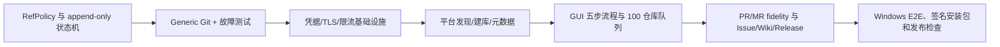

# 技术方案评审报告

## 1. 评审概述

- **项目名称**：Git Repo Migrator
- **评审日期**：2026-08-26
- **评审人**：Tech Lead Agent
- **评审文档**：PRD、`architecture.md`、`ui-spec.md`、`ui-design.json`

## 摘要

- **评审结论**：⚠️ 有条件通过
- **前次阻塞项状态**：B-1、B-2、B-3 均已修订并通过复核。
- **主要剩余风险**：UI JSON 已显式呈现 refs allowlist、平台私有 refs 排除和归档选项，并已覆盖 `native_rebuild/read_only_archive/unsupported` 三档保真度；Generic Git 创建脚本、系统 Git/LFS 分发和平台身份映射仍需实现阶段锁定契约。
- **必须解决**：无 Critical 阻塞项；第 5 节条件必须在实现和发布前完成。
- **技术债务**：系统 Git/LFS 打包策略、平台身份映射版本化、归档保留策略尚未最终定稿。

## 2. 评审结论

| 维度 | 评分 | 说明 |
|---|---:|---|
| 架构合理性 | ⭐⭐⭐⭐⭐ | 单机模块化单体符合本地数据路径、批量任务和 CLI 复用目标。 |
| 技术选型 | ⭐⭐⭐⭐☆ | Tauri 2 + React + Rust + SQLite + Windows Credential Manager 可行；Git/LFS 分发仍需决策。 |
| 可扩展性 | ⭐⭐⭐⭐⭐ | Adapter、版本化 capability matrix、模块保真度和 Generic Git 边界清晰。 |
| 可维护性 | ⭐⭐⭐⭐☆ | append-only checkpoint、lease 和统一错误契约良好；需用契约测试防止适配器语义漂移。 |
| 安全性 | ⭐⭐⭐⭐☆ | refs allowlist、私有 refs 排除、Tauri 白名单、凭据和 TLS/Host Key 保护已覆盖主要风险。 |

总体评价：架构可进入开发与任务拆解；实现必须遵守第 5 节条件。

## 3. 前次阻塞项复核

### B-1：refs allowlist 与私有 refs 隔离

**已解决。** 架构第 5.2 节已明确：默认只允许 `refs/heads/*`、`refs/tags/*` 和必要的 `HEAD`；排除 `refs/pull/*`、`refs/merge-requests/*`、`refs/changes/*`、`refs/remotes/*`、`refs/notes/*`、`refs/replace/*`、`refs/bisect/*` 和未知命名空间；使用显式 refspec，禁止无过滤 `git push --mirror`，默认不使用 `--prune`；继续同步/覆盖的删除和强制更新单独授权；excluded refs 进入报告，未知 refs 需选择归档或忽略。

实现条件：`GitRunner` 只接受已验证 `RefPolicy`；GitHub、GitLab、Gitea/Forgejo、Generic Git 必须有私有 refs 夹具测试。

### B-2：PR/MR 双保真层级

**已解决。** 架构第 3.3、4.3 节定义 `native_rebuild`、`read_only_archive`、`unsupported` 三档，并记录身份、状态、附件、源链接和逐项失败；部分成功保留已完成对象与归档，不虚报成功。

实现条件：适配器必须测试身份缺失、状态不可映射、附件失败和源链接保留；只读归档不能标成可交互 PR/MR。

### B-3：append-only checkpoint 与幂等恢复

**已解决。** `CHECKPOINT` 已改为 append-only，记录 `attempt`、`transition`、`idempotency_key`；任务使用 lease/heartbeat；恢复先查远端事实；创建、Git refs 推送和模块写入均定义幂等条件。

实现条件：故障注入需覆盖应用崩溃、目标已创建、重复 attempt、lease 接管、网络中断和重复事件消费。

## 4. UI JSON 一致性复核

`ui-design.json` JSON 解析通过，包含 6 个页面、6 类组件、7 条原型链路；页面 ID/路由无重复，原型链接无悬空引用，起始页为 `connections`。页面覆盖 `/connections`、`/repositories`、`/mapping`、`/preflight`、`/queue`、`/report`，与 `ui-spec.md` 五步主流程一致。

需求覆盖检查显示页面 frame 覆盖 FR-001 至 FR-012、NFR-001 至 NFR-003 及主要用户故事。原型条件 `source.connected && target.connected`、`finalPlan > 0`、`blocked == 0 && safetyAcknowledged`、可重试失败回队列均与架构 IPC/状态机一致。

UI JSON 的映射页已包含 `refPolicy`：默认 `gitHeadsTagsOnly`，排除 `platformPrivateRefs`/`remoteTrackingRefs`，并提供归档 refs 与自定义 allowlist 选项；映射表也展示 heads/tags 白名单、归档 refs 和排除 refs。映射、预检和报告均已显式覆盖 `native_rebuild/read_only_archive/unsupported` 三档 fidelity，并定义归档、部分成功和未迁移的结果规则；安全规则仍必须由 Rust 后端强制，不能只依赖 renderer。

## 5. 条件放行要求

1. **RefPolicy 后端强制校验**：禁止恢复裸 `push --mirror` 或任意 `--prune`；push、校验和删除均由同一 allowlist 生成。
2. **能力矩阵完整字段**：至少包含 supported、permitted、required scopes、version、reason、degradation 和 fidelity；UI 只展示后端结论。
3. **PR/MR 归档契约**：固定归档格式、敏感字段清理、附件引用和保留路径；`read_only_archive` 与 `native_rebuild` 分开统计。
4. **Generic Git 创建脚本安全边界**：显式选择本地脚本，固定工作目录、JSON 输入输出、超时和环境变量白名单；不得继承 token 或 Credential Manager secret。
5. **凭据注入测试**：HTTPS/SSH/API 认证不得进入命令行、URL userinfo、持久化环境变量、SQLite、日志或崩溃报告；Host Key/TLS 指纹由 Rust 后端校验。
6. **限流与恢复测试**：按 host/token 共享限流器处理 429/`Retry-After`；故障注入验证恢复不会重复创建、重复对象或删除未授权 refs。
7. **Tauri renderer 安全边界**：落地 CSP、origin/导航限制、文件路径校验、command 输入 schema 和危险操作后端二次校验。
8. **UI 与后端契约测试**：验证 UI 展示的 fidelity、refs allowlist、部分成功和归档路径与后端结果一一对应；refs allowlist 与 fidelity 交互已覆盖。

## 6. 技术风险与可行性

| 风险 | 等级 | 缓解措施 |
|---|---|---|
| API 版本、权限和限流差异 | 高 | 能力探测、版本快照、共享限流器、逐模块降级。 |
| Git/LFS 大仓库耗尽磁盘 | 高 | 空间预估、并发上限、检查点和清理策略。 |
| 用户/状态/附件无法跨平台映射 | 中高 | fidelity 三档、原文/链接归档、禁止伪造身份。 |
| Generic Git 无创建 API | 中 | 预检阻断，支持用户预创建或显式脚本。 |
| 系统 Git/LFS 版本差异 | 中 | 启动检测、版本矩阵、签名安装包。 |
| UI 与后端契约漂移 | 中 | 共享 schema/契约测试，后端二次校验。 |

| 功能 | 可行性 | 复杂度 | 结论 |
|---|---|---|---|
| Windows GUI + 本地执行 | ✅ 可行 | L | Tauri/React/Rust 分层可实施。 |
| 已知平台发现、建库和元数据 | ✅ 可行 | L | 适配器隔离差异，需版本化能力测试。 |
| Generic Git 手动 URL | ✅ 可行 | M | Git 数据通用，创建和平台数据正确降级。 |
| Git 历史、分支、Tag、LFS | ✅ 有条件可行 | L | allowlist refspec 和 LFS 校验已定义。 |
| PR/MR、Issue、Wiki、Release | ✅ 有条件可行 | XL | fidelity 三档控制跨平台差异，按适配器交付。 |
| 100+ 队列、暂停、恢复和报告 | ✅ 可行 | L | SQLite append-only + lease + 幂等键支持恢复。 |

## 7. 代码规范与测试

- `domain` 定义 RefPolicy、fidelity、错误分类和 checkpoint 状态机；`application` 负责预检、编排和恢复；适配器只处理平台协议；`git-runner` 只接受结构化参数和已验证 allowlist。
- Rust 类型 PascalCase、函数/变量 snake_case；TypeScript 函数/变量 camelCase；命令、事件和错误码使用稳定命名空间。
- 禁止 `mirrorEverything`、`forceSync` 等模糊 API；使用 `push_allowed_refs`、`verify_allowed_refs` 等安全命名。
- 核心路径覆盖率目标不低于 70%；RefPolicy、冲突策略、checkpoint/recovery、凭据脱敏、限流和模块 fidelity 必须测试。
- 集成测试包含私有 refs、空/非空目标、LFS、断网、429、重复启动、应用崩溃、归档和报告导出。

## 8. 实施顺序

## 9. 最终结论

- **是否通过**：⚠️ 有条件通过
- **阻塞问题数**：0
- **建议优化数**：8
- **下一步行动**：进入开发任务拆解；将第 5 节条件转成架构契约测试和开发任务，并在实现前验证 UI 展示与后端 refs/fidelity 结果一致。

## 10. 状态说明

本机未安装 `boss` CLI，无法执行 `boss runtime report-agent-status`。本报告记录终态：`DONE_WITH_CONCERNS`。
