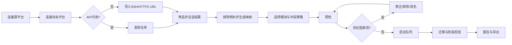

# Git Repo Migrator UI/UX 规范

## 摘要

- **产品形态**：Windows 优先的本地桌面工具；界面以批量迁移控制台为核心，不使用营销页或大面积装饰。
- **设计风格**：安静、信息密度高、可审计。浅色工作台为默认，支持系统暗色主题；危险动作始终用语义色和二次确认表达。
- **主色调**：`color-primary-600`，用于当前步骤、主要操作和链接；状态色只用于结果，不作为装饰。
- **核心组件**：步骤导航、平台连接表单、仓库数据表、条件筛选器、全选后排除栏、映射表、预检摘要、任务队列、日志抽屉、结果报告。
- **响应式断点**：`breakpoint-desktop` 为主要工作尺寸；`breakpoint-tablet` 收起次要列；`breakpoint-mobile` 改为单列和抽屉式导航。Windows 桌面不依赖触控，但可触控区域保持可操作。
- **设计系统**：使用本文定义的令牌；组件状态必须可由键盘和屏幕阅读器访问。所有页面元素追踪至 PRD 的 FR/NFR。

## 1. 设计概述

### 1.1 设计理念

迁移是一项高风险、长时间、可恢复的运维操作。界面优先回答三个问题：当前影响范围是什么、哪些仓库会被跳过或阻断、下一步是否安全。主工作区使用可排序表格和阶段状态，右侧或底部显示详情，不把百仓库任务拆成卡片墙。

### 1.2 设计原则

- **先预检后执行**：执行按钮只有在连接、映射和预检通过后才启用（FR-001、FR-004、NFR-004）。
- **默认不破坏**：非空目标显示为跳过；覆盖、可见性变更和信任自签名证书默认关闭（FR-005、NFR-003）。
- **集合优先于逐项操作**：用筛选条件定义集合，再用排除规则处理少数例外（FR-003、US-001）。
- **每项可解释**：状态徽章旁提供原因、阶段和建议动作；不以单一“失败”覆盖权限、冲突、限流和网络错误（FR-009、FR-010）。
- **本地隐私可见**：连接页明确显示“数据仅在本机处理”，凭据只显示别名和权限摘要，不显示令牌（FR-011）。
- **可恢复**：暂停、关闭后恢复和单仓库重试都保留检查点及历史尝试（FR-009、US-004）。

## 2. 信息架构

固定左侧导航（桌面宽度）按任务阶段排列：

1. **连接**：源平台、目标平台、凭据、能力探测。
2. **选择仓库**：自动发现、手动 URL 导入、筛选、全选后排除。
3. **映射与策略**：目标组织、命名规则、模块勾选、冲突策略。
4. **预检**：权限、目标状态、字段映射、磁盘和能力阻断项。
5. **迁移队列**：批次进度、阶段、暂停/继续、重试、日志。
6. **报告**：成功分类、校验摘要、失败清单、JSON/CSV 导出。

顶部工具栏显示当前批次名称、保存状态、隐私提示和帮助入口。步骤之间可以返回修改，但执行期间锁定会改变任务计划的字段。

## 3. 用户流程

### 3.1 主流程

### 3.2 流程说明

| 步骤 | 页面/组件 | 用户行为 | 系统响应 | 对应需求 |
|---|---|---|---|---|
| 1 | 连接页 | 添加源/目标平台，测试连接 | 识别平台、账号和权限；保存凭据引用 | FR-001、FR-011 |
| 2 | 仓库选择页 | 选择组织、筛选、全选结果、排除规则 | 维护全局选择计数，处理分页，不要求逐项勾选 | FR-002、FR-003 |
| 3 | 映射页 | 设置目标组织、命名模板和迁移模块 | 实时生成目标 URL 和模块能力提示 | FR-003、FR-007、FR-008 |
| 4 | 预检页 | 查看计划并修正阻断项 | 分类权限、冲突、能力和资源风险；阻断项不允许静默执行 | FR-004、FR-005、NFR-003 |
| 5 | 队列页 | 启动、暂停、恢复或重试 | 每仓库独立运行，显示阶段、重试次数和检查点 | FR-009、US-004 |
| 6 | 报告页 | 查看分类结果并导出 | 展示 Git、LFS、元数据和平台模块校验；导出不含凭据 | FR-010 |

## 4. 设计令牌

### 4.1 颜色系统

所有 UI 颜色引用以下语义令牌，组件文档不得直接新增颜色。

| 令牌 | 亮色值 | 暗色值 | 用途 |
|---|---|---|---|
| `color-primary-600` | `#2563EB` | `#60A5FA` | 主按钮、链接、当前步骤 |
| `color-primary-700` | `#1D4ED8` | `#93C5FD` | 按下/高对比交互 |
| `color-primary-100` | `#DBEAFE` | `#1E3A5F` | 选中行、信息背景 |
| `color-bg` | `#FFFFFF` | `#111827` | 窗口背景 |
| `color-surface` | `#F9FAFB` | `#1F2937` | 面板和输入背景 |
| `color-surface-muted` | `#F3F4F6` | `#374151` | 表头、禁用背景 |
| `color-text` | `#111827` | `#F9FAFB` | 标题和正文 |
| `color-text-secondary` | `#4B5563` | `#D1D5DB` | 辅助文字 |
| `color-text-muted` | `#6B7280` | `#9CA3AF` | 时间、计数、占位 |
| `color-border` | `#D1D5DB` | `#4B5563` | 边框、分隔线 |
| `color-success` / `color-success-bg` | `#047857` / `#D1FAE5` | `#6EE7B7` / `#064E3B` | 成功 |
| `color-warning` / `color-warning-bg` | `#B45309` / `#FEF3C7` | `#FCD34D` / `#78350F` | 警告、需确认 |
| `color-error` / `color-error-bg` | `#B91C1C` / `#FEE2E2` | `#FCA5A5` / `#7F1D1D` | 错误、危险操作 |
| `color-info` / `color-info-bg` | `#1D4ED8` / `#DBEAFE` | `#93C5FD` / `#1E3A8A` | 信息、能力提示 |

正文与背景组合的对比度需达到 4.5:1；状态不能只依赖颜色，必须同时显示文字或图标。

### 4.2 排版、间距、圆角和层级

| 类别 | 令牌 | 规格/用途 |
|---|---|---|
| 字体 | `font-ui` | `Segoe UI`, 中文回退 `Microsoft YaHei` |
| 字体 | `font-mono` | 等宽 URL、提交哈希、错误代码 |
| 字号 | `text-title` | 24/32，页面标题 |
| 字号 | `text-section` | 16/24，区块标题 |
| 字号 | `text-body` | 14/20，表格和正文 |
| 字号 | `text-caption` | 12/16，辅助说明和时间 |
| 间距 | `space-1` 到 `space-10` | 4、8、12、16、20、24、32、40，所有间距取令牌 |
| 圆角 | `radius-sm` / `radius-md` / `radius-lg` | 4 / 6 / 8；标签、控件、面板 |
| 阴影 | `shadow-popover` / `shadow-modal` | 弹出菜单和确认对话框；普通页面不使用浮夸阴影 |
| 动效 | `motion-fast` / `motion-normal` | 150ms / 250ms；支持减少动效偏好 |

### 4.3 响应式断点

| 断点 | 行为 |
|---|---|
| `breakpoint-mobile`（小于 768） | 左导航变为顶部步骤条；表格改为可展开行；筛选器进入抽屉；固定底部操作栏。 |
| `breakpoint-tablet`（768 至 1024） | 保留导航图标和当前步骤文字；隐藏次要列，详情用侧抽屉。 |
| `breakpoint-desktop`（大于 1024） | 左导航固定；仓库表、预检摘要和详情面板并排；队列支持多列排序。 |

## 5. 页面规范

### 5.1 全局应用壳

**布局**：左侧步骤导航宽度使用 `size-sidebar`（桌面 224），主区最小宽度使用 `size-content-min`（720），顶部工具栏高度使用 `size-toolbar`（56）。底部不常驻大页脚，执行页仅显示任务操作栏。

**导航状态**：已完成步骤显示勾选，当前步骤显示 `color-primary-600` 及文字，未完成步骤灰显但可查看，执行中锁定会改变计划的步骤并附锁图标。

**全局状态**：

| 状态 | 视觉与行为 |
|---|---|
| 默认 | 正常导航，可切换步骤。 |
| 悬停 | 导航项背景使用 `color-surface-muted`，不改变布局。 |
| 聚焦 | 2px `color-primary-600` 外框，Tab 顺序与流程一致。 |
| 激活 | 当前步骤左侧有 3px 指示条和文字标签。 |
| 禁用 | 未满足前置条件的步骤不可进入，并在 tooltip 说明原因。 |
| 加载 | 顶部显示细进度条；不阻塞已加载内容。 |
| 错误 | 顶部错误条显示错误代码和“查看详情”。 |
| 空 | 首次使用显示“添加源平台以开始”，提供主按钮。 |

### 5.2 连接页（FR-001、FR-011、FR-012）

**目标**：建立源、目标连接并完成权限与能力探测。

**布局**：桌面为左右两个“连接面板”，源在左、目标在右；顶部有本地隐私说明条。每个面板包含平台选择、实例地址、认证方式、凭据引用、测试连接按钮和权限摘要。

**平台选项**：GitHub、GitLab、Gitee、Gitea/Forgejo、通用 Git 服务。选择通用服务后，隐藏 API 发现字段，显示“手动 URL 导入可用；平台数据模块不可保证”。

**认证表单**：

- 平台地址输入支持 HTTPS URL；自建平台地址必须显示 TLS/证书状态。
- 认证方式用分段控件：Access Token、SSH Key、HTTPS 凭据。
- SSH Host Key 和自签名证书使用独立确认行，默认未选。
- 保存按钮只保存 Windows 凭据引用，不保存令牌文本。

**权限摘要**：用模块行显示 `可发现 / 可创建 / 可写 Git / 可写平台数据 / 不支持`，每行有详情 tooltip。

**状态八态**：默认空表单；悬停高亮控件；聚焦显示外框；激活显示正在测试；禁用在测试期间锁定字段；加载按钮 spinner；错误显示具体原因、重试和不保存提示；空状态显示添加连接指引。测试成功后显示平台身份、API 版本（若可用）、权限和速率限制摘要。

### 5.3 仓库选择页（FR-002、FR-003、FR-012、US-001）

**目标**：在不逐个勾选的情况下构建迁移集合。

**顶部范围栏**：源连接、账号/组织选择、刷新、手动 URL 导入。自动发现支持分页，显示“已加载 / 总数”；通用服务显示导入文件按钮和多行 URL 输入。

**筛选区**：搜索仓库名；组织/账号；可见性；更新时间；权限级别；“只显示可完整迁移”。筛选条件以可删除标签展示，条件改变后保留选择集合但更新“符合条件数”。

**全选后排除**：

1. 主按钮为“选择全部筛选结果（N）”，明确 N 是全量结果，不是当前页。
2. 选中后出现选择横幅：“已选择 N 个，当前排除 M 个”；提供“添加排除规则”和“查看排除项”。
3. 排除规则支持名称通配符、组织、单个仓库；规则可编辑、禁用和导出。
4. 右侧摘要显示最终计划数、完整迁移数、仅 Git 数和阻断数。

**仓库表**：固定首列选择框和仓库名；列为权限、可见性、更新时间、Git 能力、平台数据能力、目标状态。行支持键盘上下移动和空格切换；超过 1,000 行使用虚拟滚动，但全局计数保持准确。

**行状态八态**：默认显示数据；悬停整行浅色；聚焦有行外框；激活/选中使用 `color-primary-100`；禁用表示权限不足且选择框不可用；加载用骨架行；错误行显示“获取失败”并可单行重试；空列表显示筛选无结果和清除筛选按钮。

### 5.4 映射与策略页（FR-003、FR-005、FR-006、FR-007、FR-008）

**顶部设置**：目标连接和目标组织/命名空间；仓库名模板输入，支持源名称、组织和可见性变量；实时预览三条样例。

**模块选择**：

- Git 历史、分支、Tag：默认开启且不可取消（MVP 核心）。
- Git LFS、Submodule 检查、基础元数据：独立复选框，默认按 PRD 设置。
- Issues、PR/MR、Wiki、Release、附件：独立复选框；每项显示源/目标能力徽章。
- 可见性变更和覆盖迁移：危险开关，默认关闭；打开后出现影响范围、恢复路径和确认输入。

**冲突策略**：使用单选组，默认“空仓库复用、非空跳过”；可选“冲突自动改名”“继续同步”“覆盖迁移”。每项旁显示风险级别。通用 Git 服务无创建 API 时，展示“需要用户预先创建目标仓库”的固定提示。

**映射表**：源 URL、目标 URL、目标名称、动作、目标状态、元数据预览、模块状态。名称冲突行提供改名输入和“应用到同类冲突”。目标 URL 和动作改变时立即更新。

### 5.5 预检页（FR-004、FR-005、FR-007、FR-008、NFR-003）

**摘要条**：计划仓库总数、可执行数、阻断数、警告数、将创建数、复用数、跳过数。主按钮“开始迁移”只有阻断数为 0 且用户确认默认安全策略后可用。

**预检表**：每行显示仓库、计划动作、权限、目标状态、模块能力、磁盘需求、阻断原因和建议动作。支持“仅显示阻断/警告”。

**冲突详情抽屉**：显示目标是否为空、检测依据、将写入的引用、当前策略和替代动作。覆盖迁移必须列出会被替换的分支/Tag 数量，确认框要求输入目标仓库名。

**字段映射预览**：简介、主页、Topics、默认分支、可见性逐项显示源值、目标值、映射结果和“不支持/截断”提示。

**状态八态**：默认显示可执行摘要；悬停定位行；聚焦可打开详情；激活展开抽屉；禁用开始按钮；加载显示阶段进度；错误显示预检接口失败及重试；空状态显示“尚未生成预检”并引导返回映射页。

### 5.6 迁移队列页（FR-006、FR-009、NFR-002）

**顶部任务栏**：批次名称、总体进度（完成/总数）、当前速率、预计剩余时间、并发数、暂停/继续、取消。取消始终需要确认，并说明已完成仓库不会回滚。

**队列表**：仓库、阶段、状态、进度、重试次数、最近检查点、目标 URL、耗时。阶段枚举：预检、创建/复用、Git、LFS、元数据、平台数据、校验、完成。

**筛选与批量动作**：按状态（运行中、排队、成功、部分失败、可重试失败、跳过）、阶段和错误代码筛选；支持“只重试可重试失败”“只导出当前筛选”。

**日志抽屉**：按仓库和阶段过滤，时间、级别、错误代码、脱敏命令摘要；支持复制单条错误但禁止复制凭据。长日志虚拟化，自动滚动可暂停。

**恢复状态**：应用重新打开时显示“发现未完成批次”，提供继续、另存为新批次、放弃本地临时数据。继续前再次检查凭据和源/目标可达性。

**状态八态**：默认队列；悬停显示快捷操作；聚焦可打开行详情；激活显示当前仓库；禁用已完成行操作；加载显示阶段进度；错误显示重试按钮和原因；空状态显示预检通过后才可启动。

### 5.7 报告页（FR-010、FR-011、US-002、US-005）

**摘要区**：完整成功、Git 成功但平台数据部分失败、可重试失败、权限/冲突跳过四类结果，均显示数量和可点击筛选。

**结果表**：源 URL、目标 URL、最终状态、完成时间、Git 校验、LFS 校验、元数据、平台模块、错误代码。点击行打开“证据详情”抽屉，显示引用哈希对比、对象数量、未映射字段和建议动作。

**导出**：JSON、CSV、映射清单三个按钮；导出前显示本地路径选择。明确提示文件不含令牌，但可能包含仓库 URL、错误信息和本地临时目录位置。

**清理提示**：若用户选择保留临时目录，报告显示路径和风险说明；若清理失败，显示路径、重试和手动删除指引（FR-011）。

## 6. 组件规范

### 6.1 Button / IconButton

使用 `button-primary`、`button-secondary`、`button-ghost`、`button-danger`、`button-link`。尺寸使用 `control-sm`、`control-md`、`control-lg`，高度和内距只引用令牌。

| 状态 | 规范 |
|---|---|
| 默认 | 按变体显示，主区域最多一个 primary。 |
| 悬停 | 使用对应 hover 令牌，保持尺寸不变。 |
| 聚焦 | 2px `color-primary-600` 外框，不能只依赖颜色。 |
| 激活 | 使用 active 令牌；危险按钮显示操作对象。 |
| 禁用 | `color-surface-muted` 背景、`color-text-muted` 文字，tooltip 说明前置条件。 |
| 加载 | 保留按钮宽度，图标替换为 spinner，提供 `aria-busy`。 |
| 错误 | 不把错误状态塞进按钮；按钮旁显示错误条。 |
| 空 | 无可执行对象时禁用并提供原因。 |

图标按钮必须有可访问名称和 tooltip；暂停、继续、重试、展开、复制日志使用熟悉图标加 tooltip，不用无意义文字胶囊。

### 6.2 Input / Search / Textarea

支持默认、悬停、聚焦、激活、禁用、加载、错误、空八态。URL 输入显示协议前缀但保存完整值；令牌输入默认隐藏并提供显示/隐藏图标按钮；搜索输入 250ms 防抖，加载 spinner 不改变宽度。错误文案紧邻字段并可被屏幕阅读器关联。

### 6.3 Select / SegmentedControl

用于平台类型、组织、认证方式和视图筛选。下拉菜单使用 `color-surface`、`shadow-popover`，选项高度使用 `control-row`；支持键盘上下、Enter、Esc。无选项时显示原因和刷新入口；加载时保留已选值并显示 spinner。

### 6.4 Checkbox / Radio / Switch

选择集合用 Checkbox，冲突策略用 Radio，危险能力用 Switch。所有控件需要独立文本标签和状态文字；半选表示“当前页部分选择”时不可误认为全量选择。危险 Switch 打开后立即展开确认区域，不直接执行。

### 6.5 StatusBadge / PermissionBadge

状态必须包含文字和图标：`成功`、`警告`、`失败`、`可重试`、`跳过`、`不支持`、`运行中`、`已暂停`。权限徽章使用 `完整迁移`、`仅 Git 数据`、`权限不足`，并提供 tooltip 说明所缺权限。

### 6.6 DataTable / MappingTable / QueueTable

表格支持固定首列、排序、筛选、键盘行导航、虚拟滚动和列显示设置。选择计数必须是全量数据集，不受分页影响。长仓库名单行省略，悬停 tooltip 显示完整 URL；提交哈希使用 `font-mono`，默认显示首尾片段并可复制完整值。表格加载使用骨架行，空态使用动作指引，接口错误使用行级重试。

### 6.7 Stepper / Progress / Timeline

Stepper 表示五步主流程，阶段完成、当前、锁定和错误有不同图标与文字。Progress 同时显示百分比和 `完成数/总数`；迁移不确定时使用“处理中”而非虚假百分比。Timeline 用于单仓库阶段检查点和重试历史。

### 6.8 Drawer / Dialog / Toast / Alert

- **Drawer**：显示冲突、日志和证据详情；打开后焦点进入，Esc 关闭并返回触发控件。
- **Dialog**：仅用于覆盖、删除凭据、取消任务和信任证书等高影响动作；标题说明对象和影响范围。
- **Toast**：只用于非阻断成功/保存反馈；阻断错误使用 Alert。
- **Alert**：错误、警告、能力降级必须带错误代码、建议动作和受影响数量。

## 7. 交互规范

### 7.1 加载、空态和错误

- 首次发现仓库使用表格骨架，不显示空列表闪烁。
- 网络请求超过短反馈阈值时显示局部 spinner；长任务用阶段进度和可展开日志。
- 空组织、筛选无结果、无 API、无权限分别使用不同文案和下一步按钮。
- 错误文案格式：`发生了什么` + `影响范围` + `建议动作` + `错误代码`。禁止只显示“未知错误”。

### 7.2 确认、撤销和危险操作

- 开始迁移前显示计划摘要和默认冲突策略；阻断数必须为 0。
- 覆盖迁移需在 Dialog 中列出仓库、引用和本地备份路径，并输入目标仓库名确认。
- 取消队列不回滚已完成项；Toast 提供“查看报告”，不提供假想撤销。
- 删除凭据只删除本地凭据引用，不影响远端账号；二次确认后可撤销窗口为 5 秒。

### 7.3 键盘与无障碍

- 主流程快捷键：`Ctrl+Enter` 执行当前可提交动作，`Esc` 关闭抽屉/对话框，`Ctrl+F` 聚焦筛选，`Ctrl+S` 保存映射。
- Tab 顺序遵循左到右、上到下；表格支持方向键导航和空格选择。
- 所有状态同时提供文本、图标和可访问标签；动态进度区域使用 `aria-live=polite`，错误使用 `aria-live=assertive`。
- Focus ring 使用 `color-primary-600`，不因主题或状态移除。
- 支持系统“减少动效”；暂停时不依赖动画表达状态。

### 7.4 本地隐私提示

连接页和任务页常驻小型锁图标及“数据仅在本机处理”文字；点击打开隐私说明抽屉，列出网络目的地、临时目录、凭据存储和清理策略。日志和导出中自动掩码令牌、密码、私钥和认证头。

## 8. 边界与数据密度规则

- 100 至 1,000 条仓库：使用虚拟滚动、固定表头和全局选择集合；不得把所有仓库渲染为卡片。
- 超长 URL：表格省略，详情和 tooltip 显示完整值；导出保留原值。
- 超长仓库名称：目标名预览实时显示平台命名错误；自动改名规则必须可见。
- 部分接口失败：保留已加载仓库，顶部显示部分结果警告；允许继续预检已加载项。
- 目标状态未知：标记为“待复检”，禁止默认执行。
- 速率限制、磁盘不足、系统休眠：队列转为“已暂停/等待恢复”，保留检查点和恢复条件。
- 没有可迁移仓库：报告连接或权限问题，而非显示“任务成功”。

## 9. 可追溯性矩阵

| UI 区域 | 需求 |
|---|---|
| 连接页与权限摘要 | FR-001、FR-011、FR-012、NFR-003 |
| 仓库发现、筛选和全选后排除 | FR-002、FR-003、US-001、NFR-001 |
| 映射、模块和冲突策略 | FR-003、FR-005、FR-006、FR-007、FR-008、US-002 |
| 预检摘要与阻断详情 | FR-004、FR-005、NFR-003、NFR-004 |
| 任务队列、检查点和日志 | FR-006、FR-009、NFR-002、US-004 |
| 报告、校验和导出 | FR-010、FR-011、US-005 |

## 10. 交付检查清单

- [x] 主流程覆盖连接、选择、映射、预检、队列、报告。
- [x] 关键组件定义默认、悬停、聚焦、激活、禁用、加载、错误、空八态。
- [x] 所有颜色、间距、字号、圆角和阴影引用令牌。
- [x] 覆盖 100+ 列表、无 API、自签名证书、权限不足、冲突和中断恢复边界。
- [x] 每个页面区域映射到 PRD 需求 ID。
- [x] 键盘、屏幕阅读器、对比度和减少动效要求已定义。

## 变更记录

| 版本 | 日期 | 作者 | 变更内容 |
|---|---|---|---|
| 1.0 | 2026-08-26 | UI Designer Agent | 根据 PRD 1.0 生成 Windows 桌面迁移工具 UI 规范。 |
